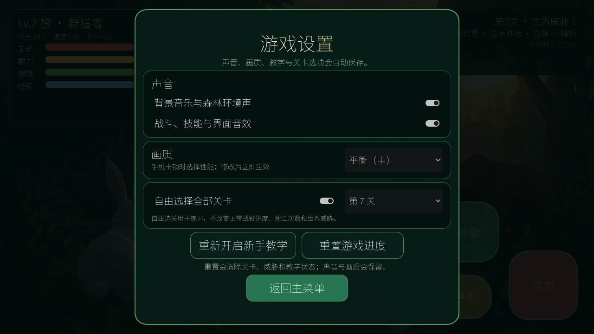

# 《生态轮回》游戏设计文档

版本：可玩实现 V1.1 + GDD V1.0
状态：首发可玩版本已完成
引擎：Godot 4.7.1  
视角：3D 斜俯视角

## 在线游玩

打开 [《生态轮回》网页版](https://976971956.github.io/eco-rebirth/) 即可直接开始游戏。电脑支持键盘操作，手机支持左侧动态摇杆与右侧技能按钮。

## 可玩版本

当前仓库已包含一个可以直接运行的完整生态对战版本：四区域程序化低多边形地图、30 种按关卡解锁的随机玩家物种、10–100 个生态个体、AI 捕食/逃亡/预测绕障/两栖速度/低空巡航/树冠逃生/合法落地/领地返回/群体号令/终局竞争、耐力与饱腹、昼夜与四种天气、局部雨幕和风暴闪电、六种野外食物、尸体进食、击杀与生态助攻经验、六类差异化的八级局内成长、30 份随机物种获胜攻略、随战况进化的原创森林背景音乐、精确战斗数值、差异化生态技能、首次进入分步教学、可继续与版本化迁移的存档、三档跨端画质、不影响战役的全关卡自由练习、死亡轮回、威胁成长与胜负结算。

- [运行、操作与三端导出说明](BUILDING.md)
- [Godot 主场景](scenes/main.tscn)
- [Web / Android / iOS 导出预设](export_presets.cfg)
- [原创菜单美术](assets/ui/menu_background.jpg)

中文界面字体使用 Noto Sans CJK SC，授权文件见 [`assets/fonts/OFL-NotoSansCJK.txt`](assets/fonts/OFL-NotoSansCJK.txt)。

用 Godot 4.7.1 打开项目后按 F6/F5，即可开始游戏。

## V1.1 成长与攻略更新

- 升级现在一定提升生命上限、当前生命、攻击、速度、耐力、护甲与耐力恢复，并在 HUD 显示每次的精确收益。
- 30 种物种分为生存适应、敏捷猎手、捕食进化、迁徙强化、重装成长、巨兽蜕变六类，不再共用一条成长曲线。
- 每局随机成为新物种后，会显示基础数值、成长方向、被动、主动技能和该物种的专属获胜攻略。
- 原创程序化森林音乐会在菜单、对战、暂停和结算间换段，并随剩余敌人和玩家伤势增强节奏。
- 设置中可打开“自由选择全部关卡”并直接练习第 1–10 关；练习结果不会改动战役进度、死亡次数或世界威胁。

## 一句话概念

玩家每次以随机物种进入一个会自行捕食、逃亡和争夺尸体的封闭生态战场；通过走位、技能和挑动食物链冲突存活到最后，并在死亡后以新物种、新地图和更危险的世界继续挑战十个关卡。

## 项目定位

本作不是追求科学级精度的生态模拟器，而是一款以“生态关系可被利用”为核心战术的单机 Roguelite 生存游戏。AI 互斗、有限资源、尸体争夺、地形克制和随机物种共同制造每局故事。

首发战役采用“封闭生态局”规则：关卡中的战斗个体数量有限，不在局内繁殖或无限刷新；环境资源可按规则少量再生。这样才能明确判定“最后存活”、控制局长并保持性能。繁殖、族群世代与长期生态平衡留给后续沙盒模式。

## 文档导航

1. [总体 GDD](docs/00_GDD总览.md)：产品定位、设计支柱、完整循环、胜负与边界。
2. [核心玩法与系统规则](docs/01_核心玩法与系统规则.md)：操作、战斗、耐力、尸体、死亡和世界威胁。
3. [物种与成长设计](docs/02_物种与成长设计.md)：属性、体型、移动域、技能模板和物种样例。
4. [生态 AI 设计](docs/03_生态AI设计.md)：感知、决策、食物链、仇恨、群体行为与性能分级。
5. [地图与程序生成](docs/04_地图与程序生成.md)：地图结构、生态区、出生安全和可复现随机。
6. [十关详细设计](docs/05_十关详细设计.md)：每关规模、物种池、机制、节奏和验收标准。
7. [Godot 技术设计](docs/06_Godot技术设计.md)：场景树、Resources、导航、存档、信号和性能预算。
8. [MVP 与制作路线](docs/07_MVP与制作路线.md)：垂直切片范围、阶段里程碑、测试指标和风险控制。
9. [数据字典与初始平衡](docs/08_数据字典与初始平衡.md)：配置字段、公式、首批物种数值与关卡参数表。
10. [运行与三端导出](BUILDING.md)：本地运行、操作方式、Web、Android 与 iOS 打包步骤。
11. [关卡物种扩展设计](docs/09_关卡物种扩展设计.md)：30 种当前实现、逐关解锁规则与现有数值定位。
12. [三十种动物制作蓝图](docs/10_三十种动物制作蓝图.md)：最终名单、十关解锁、技术改造、版本顺序、性能与平衡验收。
13. [成长数值与物种攻略](docs/11_成长数值与物种攻略.md)：六类成长曲线、30 种 Lv.1/Lv.8 实际数值与获胜原则。

## 当前关键决策

| 项目 | 决策 | 原因 |
|---|---|---|
| 视角 | 3D 斜俯视角，镜头可小范围旋转 | 多单位混战更易读，制作和镜头碰撞成本低于贴身第三人称 |
| 单局终点 | 玩家成为最后一个存活的战斗个体 | 与原始愿景一致，规则清晰 |
| “物种数量”定义 | 改为场上战斗个体数；另设可抽取物种池 | 10–100 个不同物种不具备首发可制作性 |
| AI | 效用评分决策 + 小型状态机执行 | 比纯状态机更容易产生抢尸、补刀、逃跑等生态行为 |
| 地图 | 规则驱动的模块化程序拼装 | 比运行时生成任意网格更稳定，适合 Godot 导航与内容迭代 |
| 死亡惩罚 | 当前关卡重生；世界威胁增强但有软上限和补偿 | 保留轮回压力，避免越输越不可能获胜 |
| 长期成长 | 首版只做图鉴与信息解锁，不做永久属性碾压 | 保持随机物种和生态判断的重要性 |
| 首发内容目标 | 30 种正式阵容已完成；后续转向内容精修和生态扩展包 | 先稳定首发体验，再增加新区域和物种 |

## 文档使用方式

- 策划修改规则时，先改对应系统文档，再同步 `08_数据字典与初始平衡.md`。
- 当前原型把关卡、物种与技能数值集中在目录脚本中；下一次大规模扩展前应迁移为可编辑的自定义 `Resource`，避免继续增长超长物种分支。
- 所有程序随机必须接受显式种子；出现异常生态局时，可通过种子完整复现。
- V0.2 中的数值是原型起点，不是最终平衡承诺。
