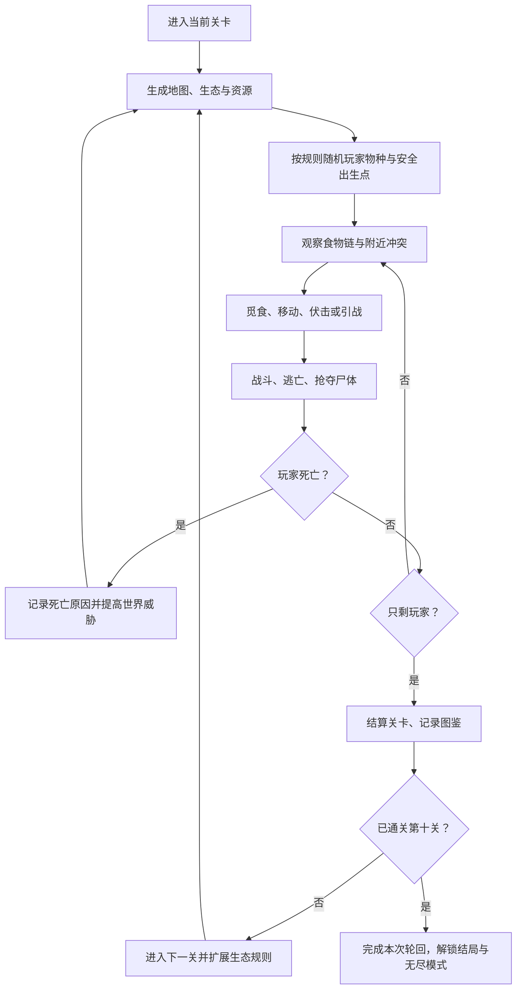

# 《生态轮回》总体 GDD V0.2

## 1. 游戏概述

### 1.1 基本信息

| 项目 | 内容 |
|---|---|
| 类型 | 单机、Roguelite、生态混战、生存动作 |
| 平台 | 首发 PC，后续视性能评估主机 |
| 引擎 | Godot 4.x 当前稳定版 |
| 画面 | 3D 风格化低多边形或中低写实 |
| 视角 | 斜俯视，默认锁定玩家，可旋转和缩放 |
| 输入 | 键鼠优先，同时按手柄可用性设计 |
| 目标局长 | 第 1 关 5–8 分钟；第 10 关 20–30 分钟 |
| 核心玩家体验 | “我没有最强角色，但我能让生态替我战斗” |

### 1.2 核心幻想

玩家不是世界中心，也没有命定英雄身份。狼群可能正在围猎野牛，鹰会抢走蛇盯上的兔子，狐狸会等待混战结束后补刀。玩家只是一名暂时占据某种生物身体的幸存者，需要读懂正在发生的生态关系并改变结果。

### 1.3 设计支柱

1. **随机身份**：每次死亡后更换物种，迫使玩家重新理解能力、猎物和天敌。
2. **自主生态**：AI 的捕食和冲突不依赖玩家触发，玩家离开后世界仍会继续演化。
3. **借势获胜**：最优策略经常是引诱、躲藏、抢尸或收割，而不是正面硬拼。
4. **可读的混乱**：战况可以复杂，但玩家必须看得懂谁在追谁、为何逃跑、哪里危险。
5. **轮回压力**：死亡会生成新世界并提高威胁，既带来新机会，也提高代价。

## 2. 游戏模式定义

### 2.1 首发主模式：十关轮回战役

玩家从第一关开始，依次通关十个封闭生态战场。每关初始化有限数量的“战斗个体”，不会在局内繁殖或凭空刷新。玩家存活且场上只剩玩家一个战斗个体时过关。

这里的“最后存活”不统计环境鱼群、昆虫粒子、不可攻击装饰动物和植物资源；只统计注册到 `PopulationRegistry` 的战斗个体。

### 2.2 后续模式

- **无尽轮回**：第十关后继续生成难度递增的混合生态区。
- **生态沙盒**：加入繁殖、衰老、迁徙和族群演化，不以清场为终点。
- **每日种子**：所有玩家使用相同地图种子、物种和世界修正。
- **物种挑战**：固定弱势或稀有物种完成特殊条件。

## 3. 完整游戏循环

### 3.1 30 秒循环

观察威胁 → 选择目标或路线 → 冲刺/攻击/技能 → 消耗耐力 → 脱离恢复 → 重新判断。

### 3.2 3 分钟循环

发现一场 AI 冲突 → 选择介入方式 → 制造击杀或等待尸体 → 进食恢复 → 改变区域食物链 → 向下一处资源或声音移动。

### 3.3 跨关循环

掌握新规则 → 遭遇更复杂的生态组合 → 通关或死亡 → 解锁物种知识 → 用玩家知识而非永久数值继续前进。

## 4. 开局流程

1. 用 `run_seed + level_index + death_count` 派生世界种子。
2. 生成生态区图、地形模块、资源点和危险区。
3. 从本关物种池抽取总个体阵容，并校验捕食层级和移动域是否可运行。
4. 从阵容中随机选取玩家个体。为避免无解局，仅排除无法在当前地图生存或无法到达任何资源的组合，不按强度偏袒玩家。
5. 为玩家寻找满足安全规则的出生点：初始视野内不得有已锁定玩家的天敌，且 8–12 秒路程内至少有一处掩体或可用资源。
6. 展示 4 秒“生态简报”：物种名称、体型、食性、主动技能、主要天敌和一个生存提示。
7. 3 秒后解除保护，生态正式运行。

## 5. 胜负与关卡状态

### 5.1 胜利

- 玩家存活；
- `alive_combatant_count == 1`；
- 最后一名非玩家个体的死亡事件处理完成。

胜利后暂停伤害，展示生态时间线、玩家击杀、间接击杀、进食次数、主要死亡风险和本局种子。

### 5.2 死亡

生命值归零立即锁定玩家输入，播放 1.5–3 秒死亡反馈。当前关卡未完成，已完成关卡不会倒退；关卡地图、资源、所有 AI 和玩家物种全部重生成。

死亡不是传统“复活”：旧世界结束，新世界是同一关卡规则下的新生态局。

### 5.3 防止消极等待

生态 AI 互斗本身可能让玩家躲到最后。允许“聪明地不参战”，但不能让最佳策略变成挂机：

- 每个生物都有饥饿压力，长期不进食会降低耐力恢复，最终持续掉血。
- 地图在中后期进入“栖息地压力阶段”，安全资源逐步集中，迫使幸存者相遇。
- 顶级捕食者会根据气味、声音和尸体热点巡猎，不会永久停留在出生区。
- 结算分别记录直接击杀和“生态策划”间接击杀，不强制最低击杀数。

## 6. 随机与公平原则

随机性负责制造新问题，不负责直接判定输赢。

- 地图必须先通过连通性、资源可达性、移动域占比和出生安全校验才可进入游戏。
- 玩家可能抽到弱势物种，但弱势意味着战术不同，不意味着没有胜利路线。
- 每种物种至少有一种稳定食物来源、一种脱战手段或地形优势。
- 首 15 秒不生成针对玩家的强制事件；出生保护只防止伤害，不允许玩家借此攻击。
- 所有关键随机结果写入运行日志，可用种子复现。

## 7. 信息与可读性

### 7.1 HUD 必需信息

- 生命、耐力、饥饿；
- 主动技能、冷却和耐力消耗；
- 当前物种和体型级别；
- 剩余战斗个体数；
- 当前天气、昼夜和世界威胁等级；
- 受击方向、危险叫声方向和附近尸体气味提示。

### 7.2 世界反馈

- 捕食关系用行为、音效和短暂目标标记表达，不常驻显示复杂箭头。
- AI 进入攻击、恐惧、觅食、争尸状态时有不同姿态或头顶短图标。
- 不同体型攻击使用清晰的冲击、硬直和声音层级。
- 水生、飞行、穴居的可通行空间必须在画面材质和地形形状上可辨认。

## 8. 内容范围约束

### 8.1 首发建议

- 30 种可玩生物；
- 10 个规则不同的关卡模板；
- 8 类生态区；
- 每种生物 1 个主动技能、1 个被动特征、1 套基础攻击；
- 约 12 个通用 AI 行为动作；
- 8–12 种天气/世界修正组合。

### 8.2 不进入 MVP

- 300 种生物；
- 繁殖、遗传和幼体成长；
- 联机；
- 任意体型的复杂攀爬；
- 完整地形破坏；
- 每种生物独立骨骼和全套独占 AI；
- 开放世界无缝加载。

## 9. 成功标准

原型成功不以内容量判断，而以以下体验成立为准：

1. 不干预时，10 个 AI 能在 5–8 分钟内产生可解释的生态结果。
2. 玩家至少能用三种方式获胜：主动猎杀、诱导混战、隐蔽收割。
3. 同一物种连续三局因地图和阵容不同而产生明显不同路线。
4. 玩家死亡后能清楚说出原因，并认为下一局有可调整策略。
5. 60 FPS 目标机器上，第十关 100 个体仍满足技术预算。
