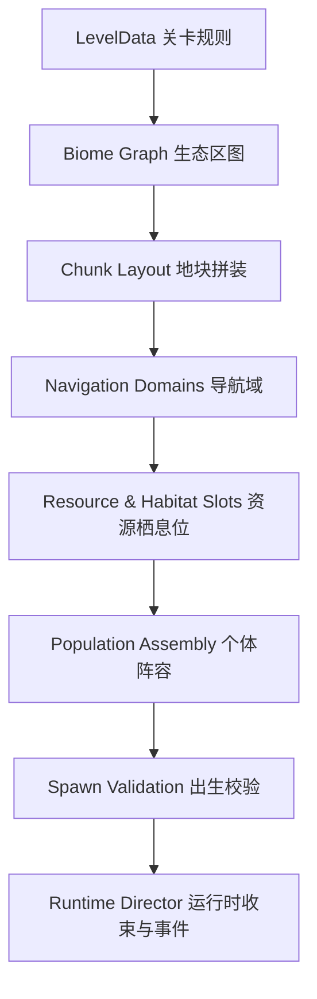

# 地图与程序生成

## 1. 地图设计目标

地图不是随机摆放障碍物，而是生态决策的发生器。每张地图必须提供：

- 捕食者可追击的开阔区；
- 小型生物可脱战的掩体和窄路；
- 至少两个高价值资源热点；
- 让移动域产生优势但不完全隔绝的水、空中或洞穴路线；
- 能把 AI 自然导向冲突的迁徙走廊；
- 中后期可收束幸存者的汇合区域。

## 2. 生成策略：模块化程序拼装

不建议首版运行时生成任意三角网格。采用编辑器制作、程序组合的地图模块：

1. 设计师制作带接口的地块场景，例如林间空地、河湾、山口、洞穴房间。
2. 每个模块保存连接口、生态标签、坡度、掩体、资源槽、出生槽和导航数据。
3. 生成器先创建抽象区域图，再把符合标签的模块放入图节点。
4. 连接相邻接口，添加装饰、资源和局部变体。
5. 校验导航连通、移动域面积、出生安全和资源分布。
6. 失败时只重试局部步骤；超过次数则回退到已验证模板种子。

这种方法能同时获得随机性、关卡美术质量和稳定导航。

## 3. 地图逻辑层



### 3.1 抽象区域图

区域图节点代表一个生态区或关键场所，边代表可通行走廊。生成约束包括：

- 所有陆地区域至少构成一个主连通分量；
- 若关卡有水生个体，水域导航必须形成足够面积的可用连通分量；
- 玩家可能抽到的每种移动域至少能从出生点到达两处资源；
- 关键资源热点之间至少有两条不同路线，避免唯一入口被大型个体永久封死；
- 洞穴出口不能只有一个，除非该房间不是出生区且提供脱困机制。

### 3.2 地块接口

每个地块记录：

- 尺寸与边界接口；
- 可连接方向、高差和通道宽度；
- 允许生态区标签；
- 陆地/浅水/深水/飞行/洞穴导航层；
- 掩体、视线阻挡和伏击点；
- 大中小出生槽；
- 植物、饮水、尸体事件、Boss 巢穴槽；
- 镜头遮挡体积与树冠淡出组；
- 预烘焙导航网格或简化碰撞源。

## 4. 生态区定义

| 生态区 | 路线特征 | 资源 | 典型优势物种 | 主要危险 |
|---|---|---|---|---|
| 森林 | 多遮挡、短视距、窄路 | 果实、草、穴居点 | 狐狸、熊、蛇 | 伏击、镜头遮挡 |
| 草原 | 开阔、长视距、少掩体 | 草、水洼 | 鹿、狼、野牛 | 长距离追逐 |
| 雪地 | 开阔与冰面混合 | 稀疏植物、鱼 | 北极熊、企鹅 | 低温、足迹暴露 |
| 山地 | 高差、山口、断崖 | 灌木、洞穴 | 山羊、鹰、熊 | 坠落、死路 |
| 湖泊 | 岸线交汇、浅深水分层 | 水草、鱼、饮水点 | 鳄鱼、河马、龟 | 岸边伏击 |
| 河流 | 线性屏障、桥和浅滩 | 饮水、鱼 | 两栖生物 | 过河暴露、逆流耗能 |
| 洞穴 | 低光、窄口、捷径 | 菌类、巢穴 | 蛇、熊、小型物种 | 围堵、回声 |
| 沼泽 | 慢速地表、浅水草丛 | 腐食、水生植物 | 鳄鱼、蛇、食腐者 | 中毒、低可见度 |
| 沙漠 | 遮挡少、资源点集中 | 绿洲、尸体 | 蛇、狐类 | 高温、沙暴 |

### 4.1 当前森林原型的四区域结构

当前程序地图固定生成四个可辨识但无加载边界的区域：

| 方位 | 区域 | 地表与资源倾向 |
|---|---|---|
| 西北 | 古木林地 | 深绿地表；野莓、蘑菇、落果 |
| 东北 | 日照草原 | 黄绿地表；嫩草、野莓、落果 |
| 西南 | 浅水湿地 | 青绿色地表；鱼群、蘑菇、嫩草 |
| 东南 | 岩丘高地 | 土黄色地表；块根、嫩草、蘑菇 |

区域通过 AI 辅助手绘地表、独立植被套装、地标剪影和 HUD“当前位置”共同表达。古木林地使用盘根古树、蕨类、菌类与倒木；日照草原使用稀疏伞树、草簇与野花；浅水湿地使用水杉、芦苇、香蒲与睡莲；岩丘高地使用层叠松树、碎石、地衣与枯草。V1.19 将四套纹理放入一个世界空间地表着色器，由确定性噪声弯曲区域边界并平滑融合；不再叠放四张矩形区域平面，因此地图不会露出规则的四色方块接缝。`region_id_at` 使用同一组噪声与尺度计算，使 HUD 区域名、环境加成、食物和植被都在玩家看到的地表边界处同步切换。

横向与纵向迁徙主路为分段弯曲路线，并在折点使用圆角接缝，仍在地图中心形成可靠汇合区。V1.32 起，可见道路与障碍净空共用同一组弯曲节点；树木和岩石还会将自身碰撞半径计入 4.8 米基础半宽，不会出现“路画在这里，净空却留在直线上”的错位。

四个区域分别使用古木门、日轮、芦苇扇和石峰作为中远距离导航地标。地标附带区域主色光环与中文名称，但不创建 `StaticBody3D`、不写入障碍数组；障碍生成另外保留 5.2 米地标净空，避免视觉标识成为路障。

实际可玩边缘使用深色低矮山脊标出，视觉地表与碰撞边界保持一致，不再出现“看起来能走、实际被空气墙挡住”的大片区域。发布校验会分别实例化第 1 关 140 米地图和第 10 关 470 米地图，用 0.85 米代表半径进行四向网格洪泛。开放格最大连通块必须至少覆盖 97%，同时检查所有地标周边可落地且障碍没有侵入迁徙主路。

边界外侧可生成少量无碰撞远景山丘，用于从斜俯视镜头遮住地表硬边。这些节点始终位于可玩碰撞方形之外，数量按低/中/高画质分别限制为 10/16/22，不写入障碍数组，也不参与导航和出生点净空计算。

V2 地图美术完整来源、运行时材质配置和跨端预算见 `docs/12_AI美术重制方案.md`。

### 4.2 当前草丛战术掩体

程序生成的草丛同时注册中心点与有效半径。视觉继续由轻量低多边形叶团组成，玩法层不添加实体碰撞，避免再次造成“看得见但过不去”的地图问题。

掩体强度同时受草丛深度和物种体型影响：

| 体型 | 草丛强度上限 | 结果 |
|---:|---:|---|
| 1 | 100% | 容易隐蔽，边缘也可蓄势 |
| 2 | 90% | 稳定隐蔽 |
| 3 | 68% | 需进入草丛较深位置 |
| 4 | 24% | 只有视觉掩护，不可伏击 |
| 5 | 0% | 无法被草丛遮蔽 |

掩体选点避开主迁徙路、地区路牌和碰撞障碍，不改变地图连通率。AI 只在有限距离内查询逃生掩体，收缩圈外的草丛不会被选为新的逃生目标。

### 4.3 当前区域反制层

四个无加载边界的区域新增统一环境查询：`movement_multiplier`、`stamina_regen_multiplier`、`stamina_cost_multiplier` 和 `terrain_counter_strength`。这些查询只读取物种目录、当前位置、天气和公开目标位置，玩家与 AI 共用。

- 主场/熟悉区域提供轻量移动与耐力效率，客场不普遍扣属性，只在密林、高地和深浅水等确有路线差异的环境承担成本；
- `best_counter_habitat` 从附近适应区域寻找合法、未被收缩排除的目标点，供弱势 AI 诱导追兵换区；
- 候选点使用区域边界、有限环形采样和现有障碍数组校验，不新增碰撞体或运行时烘焙；
- 目标必须跟进同一区域且不适应该区域，弱者的地形蓄势才可转化为逆袭；在分界线两侧不会隔区触发；
- 地形系统不修改地图可通行边界，因此最大体型连通率和现有 97% 开放格验收保持不变。

## 5. 资源生成

资源不是均匀撒点，而按生态用途分层：

- **维持资源**：低价值、高分散，避免草食者开局立即饿死；
- **竞争资源**：高价值、集中，推动中盘冲突；
- **移动域资源**：水草、鱼群、树冠落点等，为特殊物种提供路线；
- **事件资源**：腐肉、落果、迁徙群痕迹，按导演节奏出现；
- **恢复资源**：主要来自尸体，不额外放置通用回血包。

首版资源可再生，但速度受关卡阶段控制。收束期停止多数边缘资源刷新，把食物价值移向中心热点。

当前原型提供六种野外食物：嫩草、野莓、林地蘑菇、落果、块根和浅滩鱼群。草食者只能选择植物资源；肉食者能选择鱼群和尸体；杂食者可使用两类资源。资源被吃空后按类型在 13–28 秒内再生，生态收束时外圈资源停止刷新。

六种食物与尸体同时是物种生态习性的触发媒介。主场和草丛等地图条件会提高习性收益，但不会生成通用回血包；同一动物在同一资源点只能触发一次额外恢复，必须继续迁徙寻找新资源。完整对应表见 [三十种生态习性设计](13_三十种生态习性设计.md)。

### 5.1 当前生态热点实现

- 第一个热点在出生后 `34 + 1.5 × 关卡 + 0–12` 秒出现，避开首 15 秒公平保护和教学观察期；
- 后续间隔为 `72 - 1.5 × (关卡 - 1) + 0–18` 秒，高关卡保持稍快的迁徙节奏；
- 每处持续 `42 + 0.8 × 关卡` 秒，产出 `3 + floor((关卡 - 1) / 3)` 个真实食物点；
- 热点位置必须通过目标生态区和障碍物净空校验，不会改变导航、碰撞或地图连通性；
- 饥饿 AI 对适配热点的最大感知半径为地图宽度的 72%，仍使用原有路径、食性和风险判定；
- 能直接进食事件资源的动物向中心迁徙；合适的捕食者只接收迁徙规模这一公共信号，并前往热点半径外的确定性分散埋伏位；
- 埋伏位需再次通过生态区、世界边界和障碍净空校验，失败时回退到合法的热点外围点，不生成传送或穿越障碍路线；
- 世界每 0.45 秒聚合一次迁徙数和猎手数，向 HUD、热点标签和战报输出“平稳/警戒/高危”，不暴露单个 AI 的目标；
- 热点时序使用世界种子派生的独立随机流，不受地表装饰数量和画质档位影响，可按种子复现。

### 5.2 当前生态踪迹层

生态踪迹是纯逻辑数据，不实例化地面碰撞体，也不改变任何导航域：

- 地面个体按实际移动距离采样位置；飞行状态跳过，草丛中的安静移动跳过；
- 受伤、冲刺和血味提高线索强度与寿命，晴朗天气的基础足迹约保留 13 秒；
- 暴雨和风暴分别把踪迹寿命降至约 56% 和 44%，大雾延长到约 112%；
- 战斗或饥饿死亡创建短期危险地点，大体型与战斗死亡拥有更大范围和更长记忆；
- 玩家 HUD 只显示附近与自身食物链相关的猎物踪迹以及公共危险地点；
- 世界每 0.8 秒清理一次过期记录，移动踪迹上限 180，危险记忆上限 24，超限时先移除最旧内容。

该层不会给 AI 穿墙路线或当前目标坐标。猎手只能走向已经留下的旧位置，到达后仍需通过原有感知和障碍规则重新搜索。

## 6. 个体阵容生成

### 6.1 “个体数”与“物种池”

关卡表中的 10、20……100 表示战斗个体总数，包括玩家，不代表不同物种数。每关另有“物种池上限”和“本局物种种类数”。例如第一关从 6 种已制作物种中抽 4–5 种，共生成 10 个个体。

### 6.2 食物链配额

阵容生成按营养层配额而非完全均匀随机：

- 生产者/环境资源不计战斗人口；
- 草食与小型杂食约 40–55%；
- 中层捕食者约 25–35%；
- 大型/顶级捕食者约 5–15%；
- 特殊机会主义者与食腐者补足剩余；
- 顶级捕食者数量受地图面积和猎物生物量限制。

生成后运行可行性检查：每种肉食者至少存在足够猎物，每种草食者有可达植物区，水生个体不会被困在过小水体，同一单体天敌不会在玩家出生附近形成必杀包围。

## 7. 出生点规则

### 7.1 出生槽

地块提供按体型和移动域分类的出生槽。生成器先分配领地和群体，再分配单体；避免所有单位均匀成网格，让世界开局就有可解释的生态结构。

### 7.2 玩家出生安全评分

```text
安全分 = 掩体可达性 + 食物可达性 + 可逃路线数
       - 天敌威胁 - 高体型邻近 - 死路惩罚 - 移动域不匹配
```

最低规则：

- 8–12 秒路程内有适配食物或安全区；
- 至少两条可离开路径；
- 开局不在大型捕食者攻击范围或冲刺直线上；
- 群居玩家出生在同群合理距离内；
- 水生玩家不会生成到会干涸或断连的小水坑；
- 飞行玩家至少有两个合法落点。

出生保护持续 3 秒，玩家攻击、施放伤害技能或主动进食即提前结束；保护期间 AI 仍可看见玩家，但不会把玩家评为可攻击目标。

## 8. 导航域设计

### 8.1 导航层

建议至少划分：

1. 小型陆地；
2. 中大型陆地；
3. 巨型陆地；
4. 浅水/两栖；
5. 深水；
6. 洞穴链接；
7. 飞行巡航图。

不同体型不能只靠碰撞半径区分。窄洞、树根和山口应通过导航层明确控制，确保小型生物拥有真实逃生优势。

### 8.2 运行时变化

天气造成的封路优先通过启用/禁用 `NavigationRegion3D` 或 `NavigationLink3D`、修改路径成本实现，不频繁重烘焙整张地图。只有地形确实变化时才异步烘焙局部导航块。

## 9. 昼夜与天气

天气由 `WeatherData` 定义视觉、声音、感知、移动和资源修正。

| 天气 | 主要影响 | 可利用机会 |
|---|---|---|
| 暴雨 | 听觉距离下降、河流流速提高、火/气味弱化 | 掩盖奔跑声音，两栖优势 |
| 大雾 | 视觉距离大幅下降 | 伏击、弱势物种转移 |
| 暴雪 | 移动和耐力恢复受影响、足迹更明显 | 雪地物种追踪优势 |
| 沙尘暴 | 视野与远程俯冲受限、边缘区伤害 | 地面伏击与绿洲争夺 |
| 强风 | 飞行转向困难、气味传播更远更偏向 | 地面物种获得喘息 |
| 晴夜 | 普通视觉下降、听觉与发光线索突出 | 夜行物种主动出猎 |

天气必须至少提前 15 秒通过天空、风声和 HUD 预告。不能无提示地把玩家困死或切断唯一通路。

## 10. 收束机制：栖息地压力

不使用明显的毒圈作为默认表现。导演通过生态方式收束：

- 边缘食物停止刷新；
- 饮水点减少到中央区域；
- 火灾、暴雪、洪水或沙暴逐步使部分区域不宜久留；
- 迁徙声音和气味把 AI 引向新资源；
- 最后 3–5 个个体时，增强彼此留下的声音/足迹线索。

系统本质上有阶段性安全区，但表现与关卡生态主题一致。

## 11. 随机种子与复现

每局至少记录：

- 主运行种子；
- 关卡编号、死亡次数、威胁等级；
- 地图布局子种子；
- 阵容子种子；
- 玩家物种与出生子种子；
- 天气和世界修正子种子。

各系统使用独立 `RandomNumberGenerator`，不共享全局随机调用顺序。添加一个装饰随机数时，不应改变物种阵容或 AI 决策结果。

## 12. 地图验收

每张生成地图进入游戏前执行便宜校验，开发构建再执行深度校验：

- 关键导航域连通；
- 所有出生点能到达适配资源；
- 不存在落到地图外、碰撞内或导航外的单位；
- 大型个体不会生成在无法转身的地块；
- 最后收束区域对本局所有可能玩家移动域可达；
- 运行 3 分钟快速模拟时，卡住率低于目标；
- 地图模块接缝无可见裂缝、碰撞台阶或导航断层。
