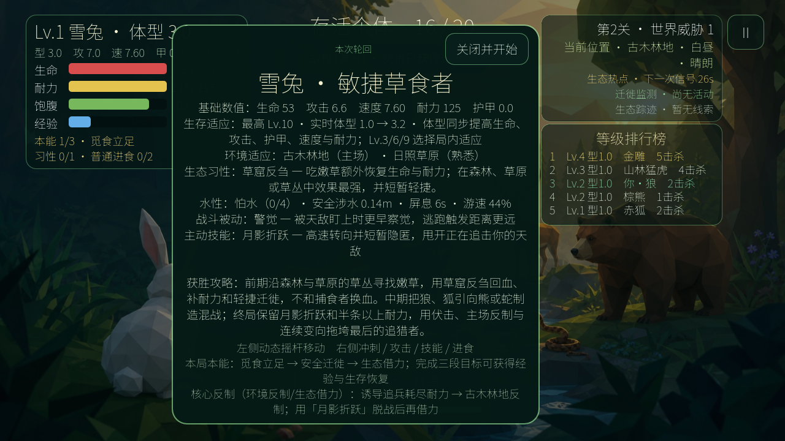

# V1.66 发布候选与真机验收

版本：1.66（Android/iOS 构建号 780）
候选状态：每次开局的物种攻略简报新增“关闭并开始”按钮，取消 8 秒自动淡出。简报显示期间世界暂停、触控战斗层隐藏，只有玩家主动关闭后才进入正式生态竞争。存档 schema 保持 5，不增加永久数据迁移。



## 1. 发布门禁

`tools/build_release_candidate.sh` 在同一份源码上顺序执行：

1. Godot 全项目解析；
2. 30 物种、技能、习性、成长与十关数据校验；
3. 存档迁移、UI、导航、外部模型与导出契约校验；
4. 1200 帧正常生态运行烟测；
5. 第 1、5、10 关固定种子性能基线及明确的 FPS、物理耗时、内存门槛；
6. Web 发布导出与四个必需文件检查；
7. iOS 工程导出与关闭签名的 arm64 原生编译；
8. Android 工具链可用时导出调试 APK，否则明确记为 `blocked_toolchain`；
9. 为 Web PCK、iOS 可执行文件及可用的 APK 生成 SHA-256，并输出 JSON 清单。

运行方式：

```bash
./tools/build_release_candidate.sh /tmp/eco-rebirth-v166-rc
```

正式候选还可加 `ECO_RC_SOAK=1`，自动追加第 1/10 关各两局完整生态收束模拟；普通候选保留该步骤为可选，以免每次小改动都执行数分钟长局。

## 2. RC1 自动化结果

| 项目 | 结果 | 说明 |
|---|---|---|
| Godot 解析 | 通过 | Godot 4.7.1 Compatibility |
| 30 物种数据 | 通过 | 数值、技能、习性、成长、关卡池 |
| 发布契约 | 通过 | 物种简报必须保持显示、关闭按钮高度至少 52 逻辑像素、按下后才发出恢复信号；主流程 `intro`暂停状态、自动烟测跳过及原有 30 物种/schema 5/移动顶点契约保持通过 |
| 运行烟测 | 通过 | 正常主场景 1200 帧，无脚本错误 |
| 性能门禁 | 通过 | L1/L5/L10 均为 60.0 FPS；物理平均 3.79/7.39/11.03 ms，内存 99.6/122.9/148.7 MiB；自动基准显式跳过手动开局确认 |
| 完整生态收束 | 通过 | 固定种子第 1 关在 191.7 秒产生唯一胜者，AI 吸收 20 包、获得 371 经验，0 饥饿/溺水死亡；第 10 关 100 动物在 859.9 秒产生唯一胜者，AI 吸收 759 包、获得 51,076 经验，10 次饥饿、1 次溺水、0 次超时 |
| Web | 通过 | `index.html/js/wasm/pck` 四项发布产物完整并进入 SHA-256 清单 |
| Pages CI | 待推送 | V1.66 推送后等待线上工作流完成 |
| iOS 工程 | 通过 | 1.66/build 780 Release、iphoneos、关闭签名的 arm64 原生可执行文件已完成编译并进入 SHA-256 清单 |
| Android | 环境阻塞 | 已有 Godot 模板和 JDK 17；缺 Platform 36、Build Tools 35.0.1、adb，Google SDK 许可尚未接受 |
| iPhone 真机 | 待人工验收 | 本次已通过关闭签名的 arm64 构建，但未执行安装、触控、帧率或温度验收 |

自动化通过不等于三端实体设备通过，没有完成实机表格时不能声称已通过真机验收。Android SDK 安装需要发布者明确接受 Google 许可；iOS 安装需要手机连接、解锁、信任电脑及有效签名。

## 3. 实体设备验收表

每个平台至少连续完成一局第 1 关，并在第 10 关运行 15 分钟。填写设备型号、系统、构建哈希和结果。

| 场景 | Web 手机 | Android 真机 | iPhone 真机 |
|---|---|---|---|
| 横屏两个方向与安全区 | 待验收 | 待验收 | 待验收 |
| 每次开局物种简报持续显示；右上“关闭并开始”触摸区清晰；点击前世界暂停、摇杆/战斗键隐藏，点击后才恢复 | 自动回归与预览通过，真机待验收 | 自动回归与预览通过，真机待验收 | 自动回归与预览通过，真机待验收 |
| 左侧任意位置动态摇杆 | 待验收 | 待验收 | 待验收 |
| 按住摇杆并按攻击、技能、进食、冲刺；摇杆不跳位且首指可继续移动 | 自动回归通过，真机待验收 | 自动回归通过，真机待验收 | 自动回归通过，真机待验收 |
| 30 种字体、图鉴滚动、结算滚动 | 待验收 | 待验收 | 待验收 |
| 棕熊厚胸、深腹、宽后躯、肩颈和承重上肢比例自然；头、短吻、小圆耳、掌行足及隐藏短尾不失真；四拍行走不滑足或折断关节 | 自动近景预览通过，真机待验收 | 自动近景预览通过，真机待验收 | 自动近景预览通过，真机待验收 |
| 暂停/切后台/恢复音频 | 待验收 | 待验收 | 待验收 |
| 存档退出重进与 schema 3/4→5 迁移 | 待验收 | 待验收 | 待验收 |
| 浅/中水隐藏屏息条；深水且越过个体涉水线后在中下显示；不挡玩家或按钮；低氧/溺水变色 | 待验收 | 待验收 | 待验收 |
| 浅/中/深水色带可辨；浅水没脚、深水水面覆盖躯干且保留头背轮廓，贴身水纹正常 | 自动预览通过，真机待验收 | 自动预览通过，真机待验收 | 自动预览通过，真机待验收 |
| 水下动物皮肤正常显示，无骨架残影、整体埋地或水面漂浮 | 待验收 | 待验收 | 待验收 |
| 右下四键图标清楚、间距稳定；30 种主动技能不再仅显示文字，冷却外环和状态可辨 | 自动预览通过，真机待验收 | 自动预览通过，真机待验收 | 自动预览通过，真机待验收 |
| 雪兔/水獭水性差异、捕鱼回血与饱腹 | 待验收 | 待验收 | 待验收 |
| Lv.1→10 模型、碰撞、血量、攻击、速度和涉水线连续增长 | 待验收 | 待验收 | 待验收 |
| Lv.3/6/9 三路线选择完整、按钮不遮挡、选择后恢复游戏 | 待验收 | 待验收 | 待验收 |
| 三段生态本能在左上持续显示；偏好觅食/普通进食、主场迁徙/反制、击倒/助攻均能推进，完成提示和奖励清晰 | 自动回归通过，真机待验收 | 自动回归通过，真机待验收 | 自动回归通过，真机待验收 |
| 关闭简报后 8 秒内玩家与 AI 均不会受伤；攻击或技能解除自身保护 | 自动回归通过，真机待验收 | 自动回归通过，真机待验收 | 自动回归通过，真机待验收 |
| 普通/富集/珍稀食物可辨，玩家与 AI 都会争夺并正确获得经验 | 待验收 | 待验收 | 待验收 |
| 经验雨严格每60秒刷新；第1–10关分别生成10–100个包；四象限分布且上一轮不会叠加 | 自动回归与预览通过，真机待验收 | 自动回归与预览通过，真机待验收 | 自动回归与预览通过，真机待验收 |
| 青/紫/金三档3D能量晶体、轨道碎片、地面基座和近距经验文字清楚，100包同时存在时不卡顿 | 自动预览与 63 秒图形长性能样本通过 | 自动预览通过，真机待验收 | 自动预览通过，真机待验收 |
| 经验越多吸收越久；吸收中无法移动、冲刺、攻击或释放技能，移动/离开/受击正确打断 | 自动回归通过，真机待验收 | 自动回归通过，真机待验收 | 自动回归通过，真机待验收 |
| AI 会抢经验包，低血近敌时会放弃长读条；批测记录经验包数与经验量 | 自动生态模拟通过，真机待验收 | 自动生态模拟通过，真机待验收 | 自动生态模拟通过，真机待验收 |
| 仅剩 3 只时，另外两只的方向、距离、排行榜提示和穿透场景标记持续可见，AI 主动收束 | 自动回归与预览通过，真机待验收 | 自动回归与预览通过，真机待验收 | 自动回归与预览通过，真机待验收 |
| 加宽河道的浅/中/深水和渡口与视觉一致，无新增不可达区域 | 待验收 | 待验收 | 待验收 |
| 四边连续地表带、引导线与生态边界界碑 | 待验收 | 待验收 | 待验收 |
| 肉食 AI 主动攻击附近玩家与其他 AI，且不跨图仇恨 | 待验收 | 待验收 | 待验收 |
| 任意物种近身遭遇：强者局部驱赶、弱者主动逃跑、同强度观望；玩家与 AI 规则相同 | 自动回归通过，真机待验收 | 自动回归通过，真机待验收 | 自动回归通过，真机待验收 |
| 尸体完整一口回血明显、最后残渣不触发完整治疗；提示显示准确生命/饱腹增量 | 自动回归通过，真机待验收 | 自动回归通过，真机待验收 | 自动回归通过，真机待验收 |
| 落果潮可见 15–24 个高容量落果点；低血草食/杂食 AI 主动前往，肉食 AI 不把落果当药包 | 自动回归通过，真机待验收 | 自动回归通过，真机待验收 | 自动回归通过，真机待验收 |
| AI 绕过树木/岩石/岸线时保持同侧，越过后不折返；被挡住时模型不原地转圈 | 自动回归通过，真机待验收 | 自动回归通过，真机待验收 | 自动回归通过，真机待验收 |
| 第 10 关帧率、温度、耗电与内存 | 待验收 | 待验收 | 待验收 |
| 无卡死、无不可达终局、无持续抖动 | 待验收 | 待验收 | 待验收 |

阻断条件：崩溃、存档丢失、主流程无法完成、摇杆方向错误、180° 横屏翻转错误、关键按钮被刘海/圆角遮挡、持续低于目标帧率或设备过热。任何阻断项出现后必须生成新候选，不在旧 RC 上口头放行。

## 4. 发布材料

- 游戏名称：《生态轮回》/ Eco Rebirth；
- 版本：1.66，构建号 780；
- 支持：Web、Android 7.0+（API 24）、iOS 15+；
- 方向：仅横屏，支持左右两个横屏方向；
- 联网：游戏逻辑不需要账号或网络；网页版仅从 GitHub Pages 下载静态资源；
- 数据：进度、设置、图鉴和最近十局只保存在设备本地；
- 权限：当前版本不使用相机、麦克风、照片、位置、联系人或推送；
- 商业组件：无广告、无内购、无第三方分析或追踪 SDK；
- 隐私详情见[隐私说明](16_隐私说明.md)。

## 5. 人工放行步骤

1. 接受 Android SDK 许可并安装 Platform 36、Build Tools 35.0.1 与 Platform Tools；
2. 重新运行 RC 脚本，确认 Android 从 `blocked_toolchain` 变为 `passed_debug_apk`；
3. 将 iPhone 连接、解锁并信任 Mac，用发布者 Team 签名安装；
4. 完成上表三端真机项并附设备、系统、帧率与温度记录；
5. 确认 Git 提交、构建清单 `source_ref` 与商店上传包一致后创建正式标签。
