# 写实美术与动画生产方案

版本：V2.0 制作基线

适用范围：30 种物种、四生态区、10 个关卡、30 种主动技能、Web / Android / iOS / macOS

制作工具：Blender 5.2.0 + Godot 4.7.1 Compatibility

## 1. 目标风格

新美术定位为“可在手机与 Web 稳定运行的风格化写实”，而不是照片扫描或电影级毛发。成片应同时满足：

- 解剖比例可信：肩高、头躯比、四肢关节、足掌落点与尾部重心接近真实动物；
- 远距离可识别：不依赖颜色换皮，15–30 米外仍能从轮廓区分物种；
- 材质有层次：毛皮、羽毛、鳞甲、角质、湿润鼻面、眼球、树皮、苔藓和湿土使用不同 PBR 反射特征；
- 动作有重量：足部接地、躯干传力、转向倾斜、攻击预备与收势明确，不再像模型整体平移；
- 特效服务判定：起手、攻击方向、命中时刻、危险范围和状态持续时间必须比纯装饰更清楚；
- 地图不制造假通路：美术模型与碰撞/导航分离，小植被、落叶和苔藓永远不阻路。

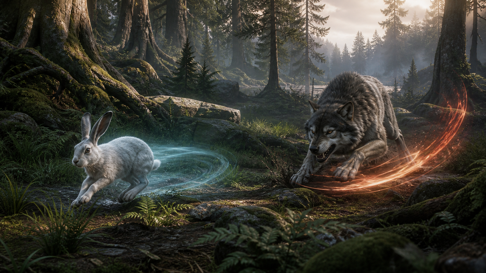

## 2. 为什么使用 Blender

Godot 继续负责运行时、AI、碰撞、技能判定、程序地图与跨端渲染；Blender 专门负责：

1. 解剖比例与高/低模体块；
2. 拓扑、UV、法线、材质烘焙与 PBR 贴图；
3. 骨架、蒙皮、足部接地与动作循环；
4. Hero / Mobile / 远景细节档导出；
5. 树木、岩石、草丛、芦苇、倒木、岩壁与地标的模块化套件。

不强制增加 Maya、Substance Painter、ZBrush 或付费插件。Blender 的建模、雕刻、Geometry Nodes、烘焙、骨架、NLA 和 glTF 导出已覆盖本项目首发需求。

## 3. 资产档位与预算

### 3.1 物种

| 档位 | 使用者 | 三角面目标 | 贴图 | 骨骼 | 材质槽 |
|---|---|---:|---:|---:|---:|
| Hero | 中/高画质玩家 | 6k–35k，按轮廓复杂度 | 纯 PBR 色块；后续家族图集 | 8–16 | 约 3–5 |
| Mobile | AI 与低画质玩家 | 1k–8k，按轮廓复杂度 | 与 Hero 同色板 | 8–16 | 约 3–5 |
| Detail | 眼、齿、胡须、角枝、斑纹、羽片 | 计入上述预算 | 共用 | 刚性附件优先 | 不新增槽 |

第 10 关最多 100 个体，AI 始终使用 Mobile。同屏不按“30 种模型的文件总面数”估算，而按实际可见个体、材质切换和皮肤变形成本验收。远处个体继续使用 body/detail 裁剪与动画降频。

### 3.2 地图

- 大树：1.5–6k 三角面，2 个 LOD，树干与叶簇最多 2 个材质；
- 岩石/倒木：800–2.5k 三角面，共用 512–1024 图集；
- 草丛/芦苇/蕨类：40–120 三角面，单体先合并为一个网格；同类实例达到数百个时使用 MultiMesh，无碰撞与逐实例每帧脚本；
- 地标：5–12k 三角面，纯视觉，保护主通路净空；
- 地表：保留世界坐标四区混合，增加法线/粗糙度与宏观色差，不改变现有导航几何。

V1.67 的战术草丛已完成运行时轻量替换：每丛合并为一个 72–112 三角面的草叶网格、一个共享轻风材质和零碰撞节点，替代旧版四个独立椭球叶团。现阶段单局仅 26–78 个战术掩体，单网格节点已显著降低绘制与节点开销；若后续把装饰草扩展到数百丛，再按四区与形态变体升级为 MultiMesh 批次，不提前牺牲当前每丛的确定性轮廓差异。

### 3.3 特效

- 单次技能高画质不超过 48 个粒子，低画质不超过 18 个；
- 同屏特效软上限 16 组，AI 远景技能使用简化环/方向弧；
- 不使用屏幕空间折射、高成本流体、计算着色器或依赖 Forward+ 的效果；
- 使用兼容 Compatibility 的加法材质、软粒子、简化体积弧、地面印记和短尾迹；
- 技能颜色是辅助识别，形状、方向与节奏才是主要信息。

## 4. 骨架家族

30 种物种使用 10 个骨架原型，共享动作语义，不共享完全相同的幅度与节奏：

1. `lagomorph`：雪兔，后足主导的束步与跳跃；
2. `canid_small`：赤狐、浣熊、狼獾、水獭，快步、低身与敏捷转向；
3. `canid_pack`：灰狼、斑鬣狗，小跑、围猎侧移与扑咬；
4. `felid`：猫科、猎豹，脊柱伸展、潜行与爆发扑击；
5. `ungulate`：林鹿、斑马、驼鹿、山羊、野牛，蹄类小跑、奔驰与角击；
6. `heavy_quadruped`：棕熊、野猪、豪猪、水豚、巨象、犀牛、河马，低频重步与冲阵；
7. `primate`：猕猴、银背，双足/四足过渡、拳步与投掷；
8. `avian`：雪鸮、金雕，滑翔、振翅、俯冲、落地与收翼；
9. `long_body`：青环蛇、沼泽鳄，多段脊柱、游动、爬行与翻滚；
10. `chelonians`：陆龟，低伏步行、伸缩头颈与缩壳。

所有地面骨架都提供 `idle / locomotion / sprint / attack / skill / hit / eat / death` 语义；鸟类增加 `glide / flap / dive / land`，水生/两栖类增加 `swim`。动作以 30 FPS 烘焙，运动保持 in-place，位移和命中仍由 `EcoActor` 掌控。

## 5. 物种生产规则

1. 先完成骨架家族的中性基模与完整动作集；
2. 根据真实参考调整每种的肩高、胸腔、头型、耳、吻、角、爪与尾；
3. 用法线、粗糙度、宏观色块和少量轮廓毛束表现毛发，禁止逐根毛发和大面积透明毛片；
4. 眼球使用独立高光与暗色虹膜，鼻面、嘴缘、鳞甲使用受控的湿润粗糙度；
5. Hero 与 Mobile 必须共用骨名、动作名、技能挂点与根比例；
6. 碰撞体、攻击距离、移动速度、AI 半径和数值不从网格自动推导；
7. 新 GLB 加载失败时必须回退当前 V1.39 模型，避免资源损坏阻断游戏流程。

## 6. 技能特效家族

30 个主动技能组合 6 种基础模块：

| 家族 | 主要信息 | 代表技能 | 视觉元素 |
|---|---|---|---|
| 位移 | 路径和结束点 | 月影折跃、旋水突袭、极速猎杀 | 短尾迹、落点环、地面风压 |
| 扑击 | 攻击方向与命中 | 群猎扑杀、无声飞扑、裂风扑杀 | 双弧爪痕、短促冲击、命中火花 |
| 冲阵 | 宽度、方向和击退 | 獠牙突阵、踏阵冲锋、破阵角冲 | 土尘、双侧气流、击中碎屑 |
| 范围 | 中心、半径与时刻 | 领地震荡、踏阵、象群践踏 | 边界环、地裂、低空压波 |
| 防御/状态 | 持续时间与受击状态 | 缩壳坚守、怒刺绽放、同栖安抚 | 轮廓光、呼吸光环、少量漂浮粒子 |
| 投射/俯冲 | 飞行路径与落点预警 | 果实投掷、影夜俯冲、天穹贯击 | 拖尾、落点图形、冲击羽流 |

每个物种必须有独立的节奏、轮廓和生态材质，不只是改变颜色。例如雪兔的尾迹是轻、快、低位的冷风；灰狼是两段收拢的暗红爪弧；野猪是向外爆开的土石；水獭是贴水面扩散的涡流。

## 7. 地图模型套件

| 生态区 | 大型模块 | 中型模块 | 小型散布 | 特殊材质 |
|---|---|---|---|---|
| 森林 | 4 古树、2 根系门、3 树冠 | 倒木、苔石、腐木 | 蕨、菌、落叶 | 苔藓覆盖与湿木 |
| 草原 | 3 伞树、2 风化岩组 | 高草岛、旱河床 | 短草、野花、种籽 | 风向草浪与干土 |
| 湿地 | 3 水杉、2 浅水林 | 木桥、泥洲、枯桩 | 芦苇、香蒲、睡莲 | 湿润度、水痕与泥面 |
| 高地 | 4 岩峰、3 松树 | 岩壁、石阶、洞口 | 枯草、地衣、碎石 | 高度色差与风化边 |

模型只替换视觉节点，障碍体列表、净空半径、弯曲通道、食物生成与区域判定继续由 `EcoWorld` 负责。任何批次都必须通过第 1/10 关最大开放区连通率验收。

## 8. 制作阶段

### 阶段 A：纵向切片

完成雪兔、灰狼、古木林地套件、月影折跃和群猎扑杀。检查 Hero/Mobile 差异、解剖比例、足部接地、攻击时序、技能判定可读性、第 10 关帧时间与包体增量。

V1.40 已完成首轮：两种动物各有 Hero/Mobile、16 骨骼、四条两段腿和八态动作；两款古树接入中/高画质森林；两个技能完成独立组合。该阶段通过自动几何/骨骼/动作/材质/连通率/Web 导出检查后进入阶段 B，真机温度与触控仍留在最终发布验收。

### 阶段 B：骨架家族

按 `canid / felid / ungulate / heavy / primate / avian / long_body / chelonians` 逐批完成余下物种。每批先完成一个代表种，再复用骨架和动作语义，但必须调整关节位置、身体比例、步频、步幅与攻击节奏。

V1.41 已完成阶段 B：剩余 28 种 Hero/Mobile 全部导入，26 种地面动物使用 16 骨连续体表与四条两段腿；雪鸮/金雕使用 10 骨双段翼；青环蛇/沼泽鳄使用 8/12 骨长体。60 份 GLB 均通过骨数、蒙皮归一化、混合权重、八态动作、技能挂点、Hero/Mobile 差异与自动 LOD 检查。生成器另外强制每个 `OrganicBodyV2` 只有一个连通网格岛，避免足、耳和尾脱离躯干；翼、长鼻和主甲壳划入轮廓 LOD，不会在正常镜头距离下消失。Godot 运行时还会实例化全部物种验证模型前向和攻击挂点。

Web 实机检查暴露了一个坐标系契约问题：Blender 骨骼导入 glTF 后的局部 rest basis 并不等于旧 Godot 程序骨架的标准轴，直接写入旧欧拉角会将连续蒙皮拉成串状。现在 `EcoActor` 只负责解析游戏状态和速度，并选播 GLB 内的 `idle / locomotion / sprint / attack / skill / hit / eat / death`（鸟类和长体物种含对应扩展）烘焙动作；旧程序姿势只在模型确实没有对应动作时回退。发布校验会通过真实 `EcoActor` 路径确认 30 种骨骼物种都绑定 `AnimationPlayer`，并检查奔跑、攻击、技能、受击和进食的状态映射。

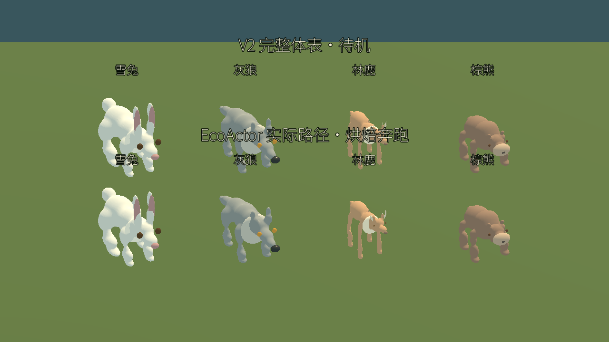

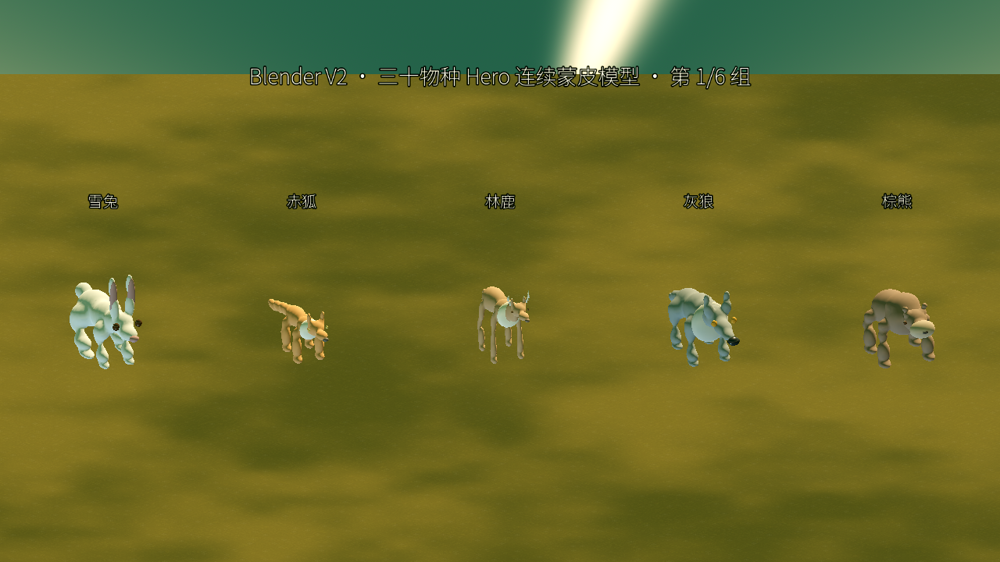

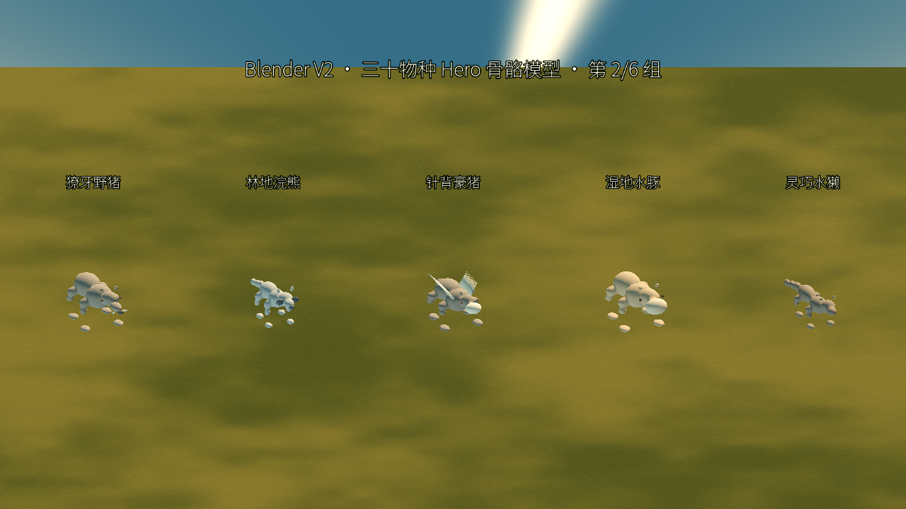

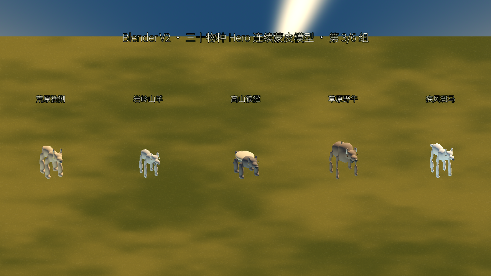

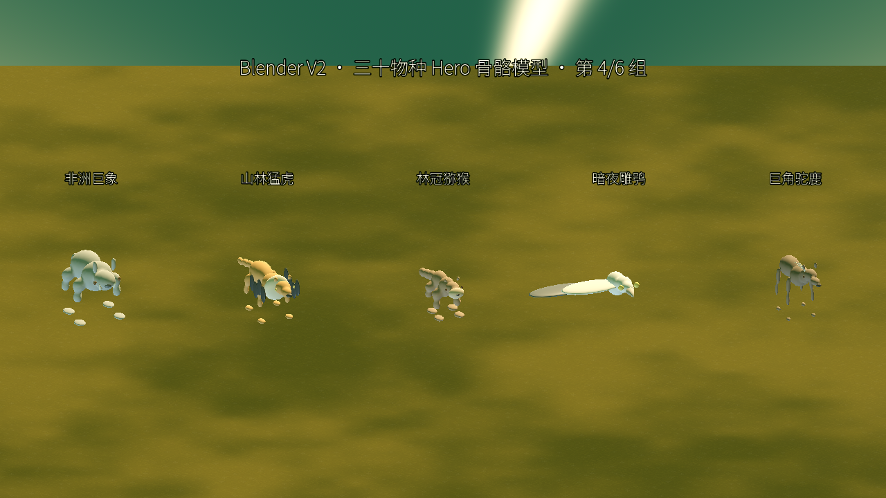

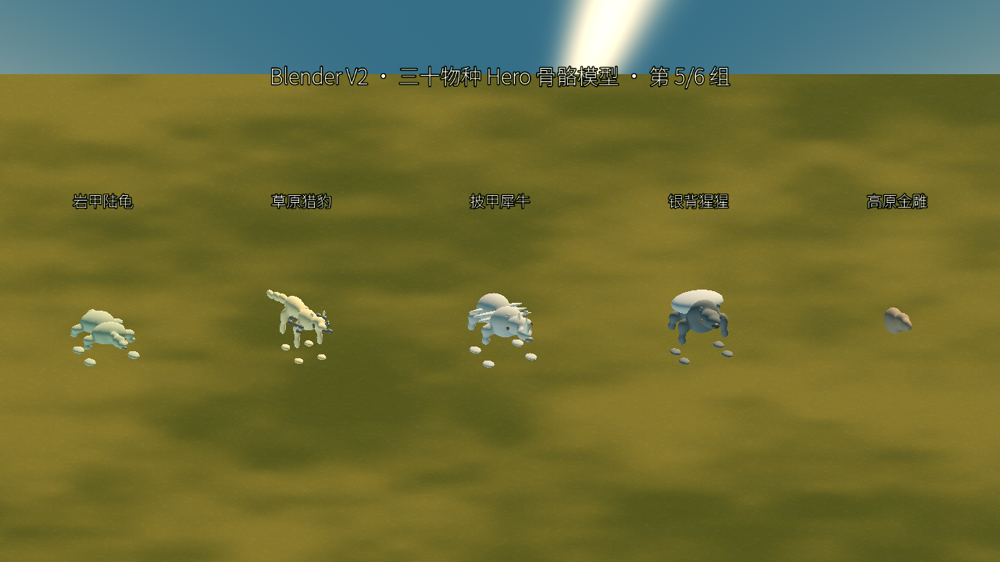

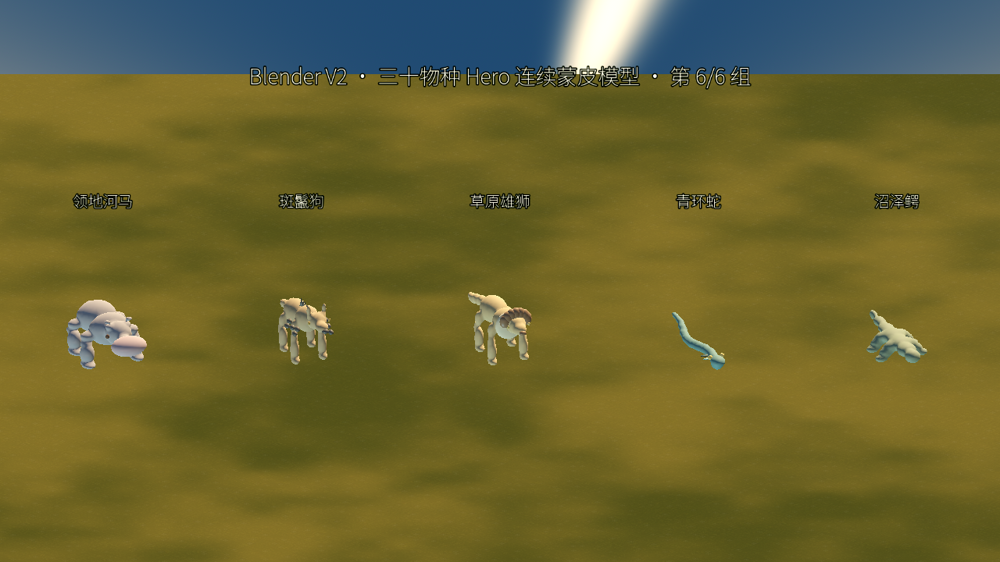

### V1.42：AI 原创林鹿 V3 质量基线

V1.42 开始从“科属通用模板”过渡到“每个物种独立设计”。第一个基准物种是林鹿：使用 AI 生成的原创五视图与八帧步态图确定体型、胸腔、腰腹、颈线、鹿角、鹿蹄和前后肢关节。参考图只用于原创设计与比例判断，游戏中实际使用的是 Blender 生成、骨架化和导出的 GLB，不把平面图假冒成 3D 模型。

- Hero 为 15,036 三角面 / 7,596 顶点，Mobile 为 6,204 三角面 / 3,176 顶点，均为 16 骨架。
- 躯干、颈部和头部使用连续蒙皮主体；腿部改为物种专属的渐细肢段、肌肉连接、小尺寸鹿蹄，避免四根等长直杆。
- `locomotion` 使用左前、右后、右前、左后错开的四拍步序；`sprint` 使用前后肢收集的奔跑相位，并加入胸腔、颈部、头部与尾部的微小反向补偿。
- 待机耳部抽动、低头进食、鹿角攻击/技能、受击和侧倒死亡均在 GLB 中烘焙，依旧由 `EcoActor` 根据游戏状态选播。
- 鹿眼、鹿蹄、鼻面和小型斑块保留独立远景裁剪；30 种 Mobile 总顶点为 118,212 / 140,000。

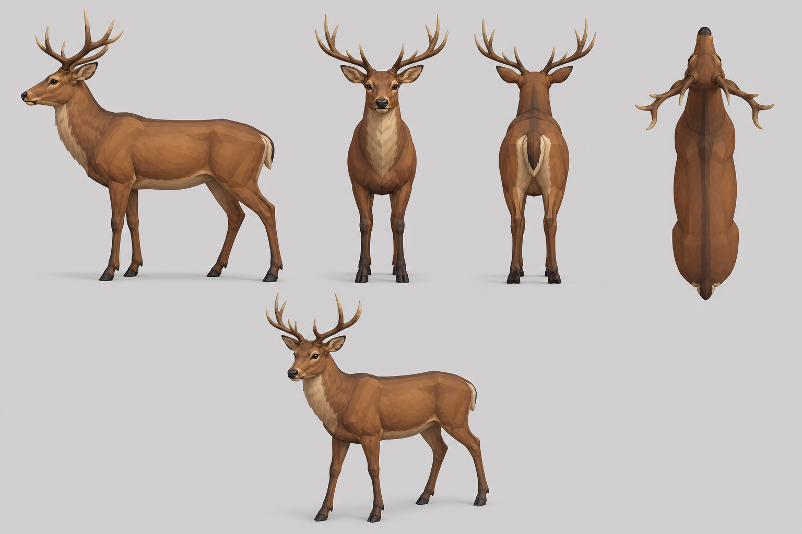

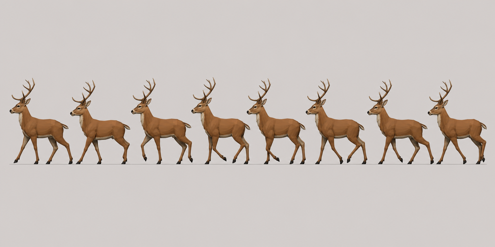

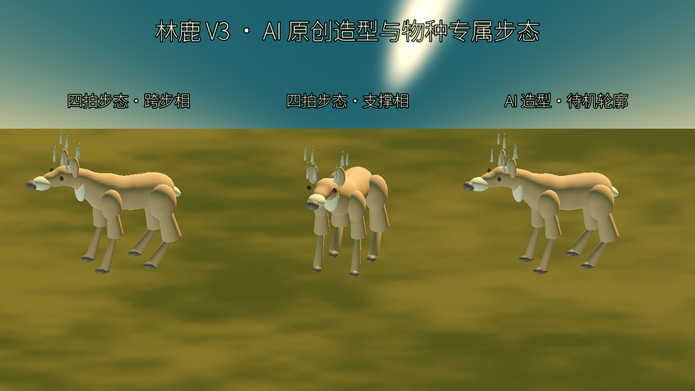

后续 29 种按独立物种逐个升级，每个物种都要经过“AI 原创设定→解剖与轮廓评审→Hero/Mobile 建模→物种专属步态→Godot 近景与游戏镜头双重验收→三端预算”。不再以“拥有骨架和动作”代替“看起来像对应动物”。

### V1.43：剩余 29 种 V3 生产完成

V1.43 按上述流程完成了林鹿之外全部 29 种。为了在可运行性、Web/手机预算和物种识别度之间取得稳定结果，本批次保持风格化低多边形表现，但不再允许同科动物只换颜色。

- 原创设定分为小型哺乳、猎食者、有蹄类、巨兽、灵长和鸟爬六组；设定图只规定轮廓、比例、姿态和特征，实际运行的蒙皮网格均由 Blender 生产脚本构建。
- 23 种通用地面骨架动物引入物种级胸肩/臀部质量、站距、前后肢长、上下肢粗细、膝踝落点、蹄爪和攻击姿态。步态包含小跑、潜行、踱步、踱跃、负重慢行、冲锋、蹄踢和指关节行走。
- 雪兔与灰狼保留连续毛皮主体，分别重做成后肢同相束步和对角小跑。猴子与大猩猩拥有压缩的前后体轴、高肩带与长前臂，不再读成犬科。
- 雪鸮与金雕改为扁平收尖的翼梁、分层初级飞羽与三片尾羽，并分离了圆面盘/金色颈羽和快速安静拍翼/低频强拍节奏。青环蛇与沼泽鳄采用 9 采样点连续体波，鳄鱼四足叠加对角低姿爬行。
- 全部 Hero/Mobile 资产保留 8 个核心烘焙动作和技能挂点。`OrganicBodyV2` 必须只有一个连通主躯干网格岛；眼、鼻、蹄爪、飞羽和斑纹保留独立距离裁剪。
- 30 种 Mobile 总顶点 121,647 / 140,000，低于第十关 100 个体预算。六组静止轮廓与移动动作定格共 12 张图由 Godot 真实 `EcoActor` 路径生成。

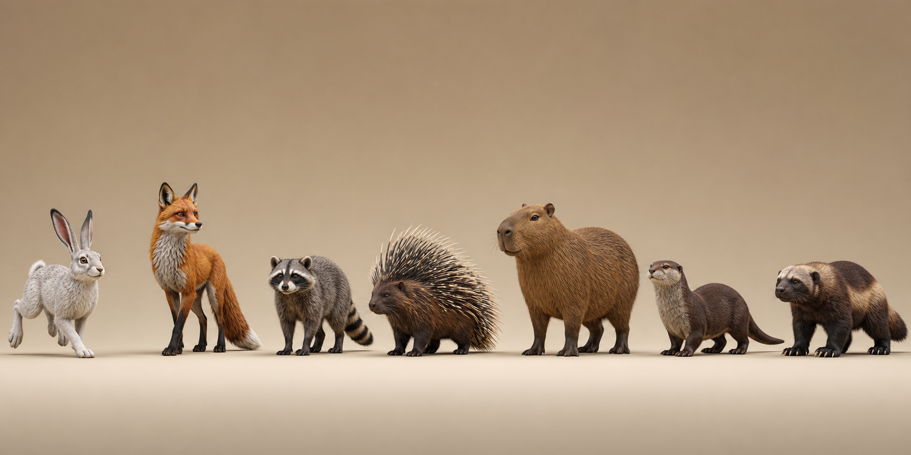

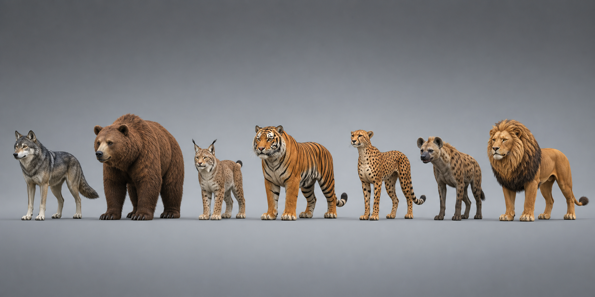

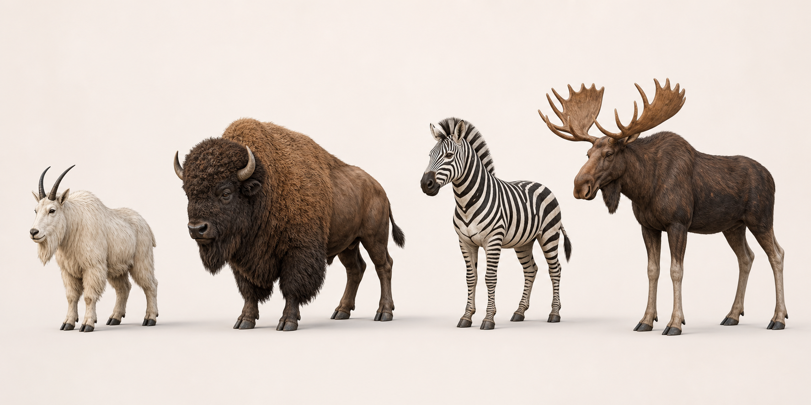

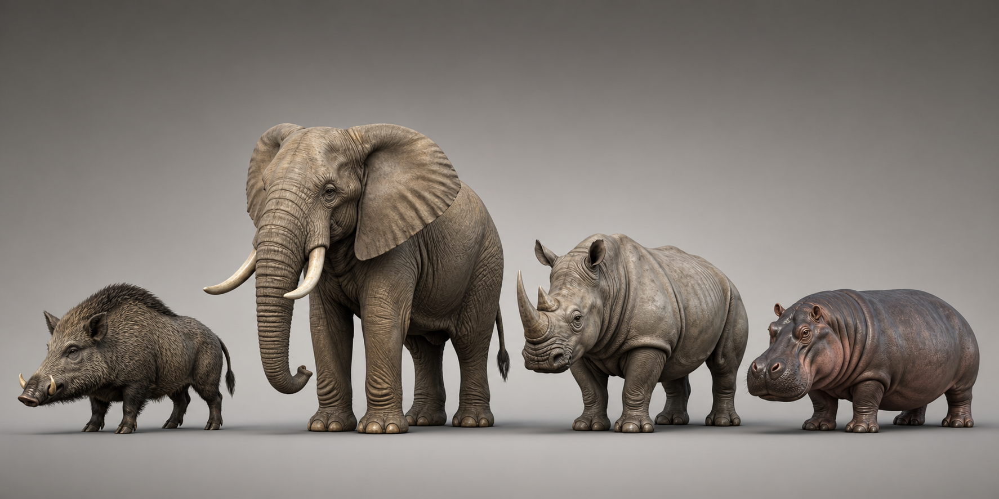

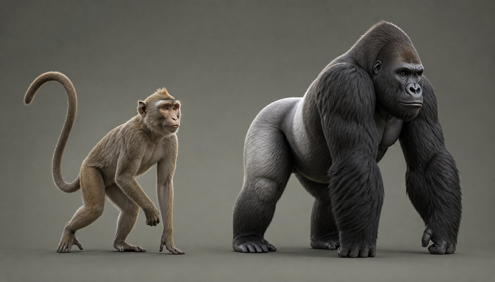

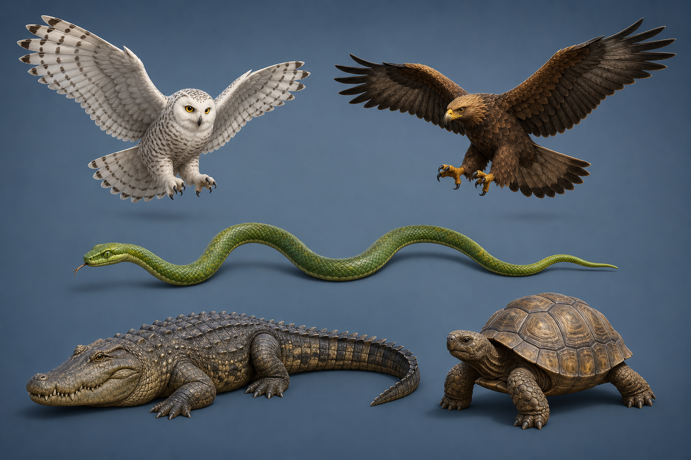

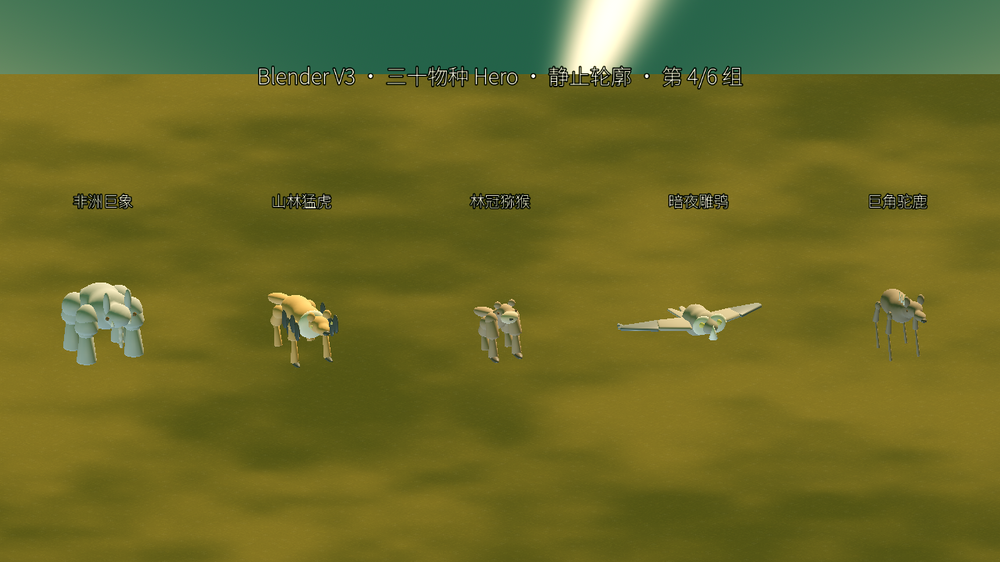

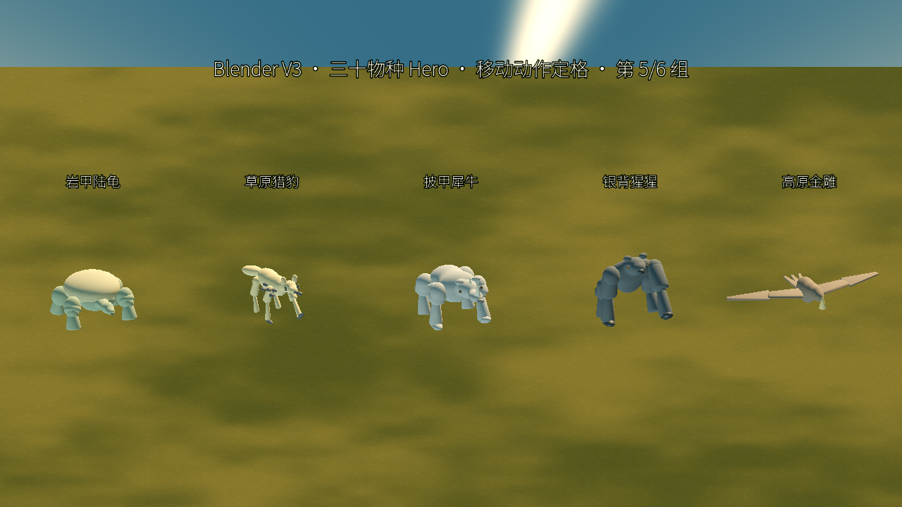

### V1.44：灰狼电影化方向实时样板

V1.44 用一只狼验证“专业基础网格 + AI 贴图 + Blender 游戏化处理 + Godot 三端运行”的质量上限。基础网格来自 NewDLC 在 OpenGameArt 发布的 CC0 `3d wolf`，源文件、原始贴图、修改贴图和许可证均保存在 `assets/source/animals/wolf/cc0_newdlc/`；Godot 通过 `.gdignore` 跳过制作源，只加载最终 GLB。

- AI 在严格保持 UV 岛位置的前提下将原棕色贴图重绘成灰狼毛色；Blender 重新连接 Albedo、Normal、Roughness，并按 Hero 1024 / Mobile 512 输出。
- 源模型的 36 骨精简为 32 骨，保留脊柱、头颈、下颌、四肢、眼部与四段尾链；四个终端趾骨权重安全合并到掌骨，满足移动端骨数预算。
- Hero 为 20,348 三角面 / 10,418 顶点，Mobile 为 5,358 三角面 / 2,923 顶点。两档均保留八个核心动作、四足关节名以及嘴部/胸部技能挂点。
- 主躯干在 Blender 源拓扑上强制验证为单连通岛。glTF 为 UV 与切线接缝拆分渲染顶点，因此节点名携带 `SourceConnected` 合同，Godot 门禁不会把合法 UV 接缝误判成断肢。
- 30 种 Mobile 总顶点为 121,264 / 140,000。该样板定位为手机/Web 可实时运行的写实游戏资产；真正离线影视高模还需要扫描级雕刻、毛发曲线、4K/8K UDIM、肌肉/皮肤解算与离线渲染，不直接进入百只动物同场的游戏包。

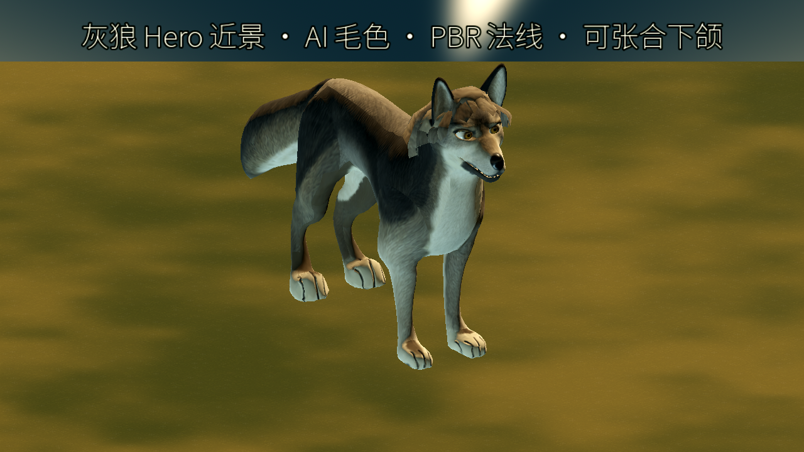

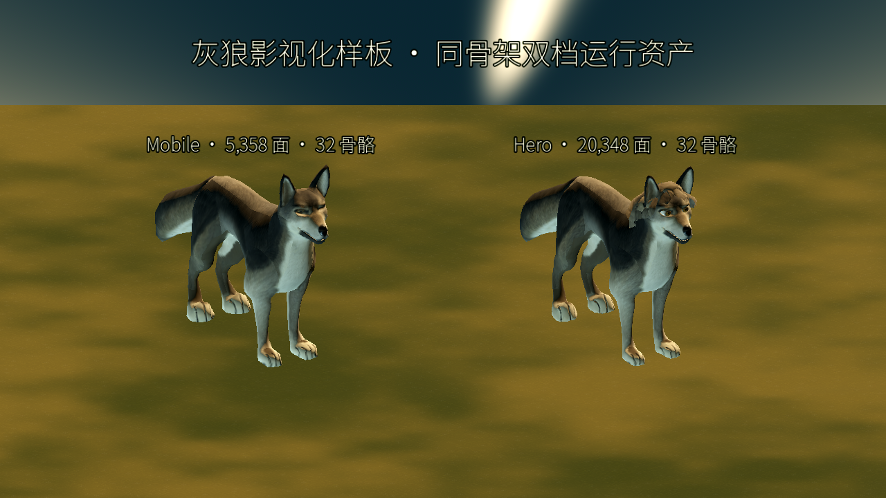

### V1.45：成年灰狼体态与正确小跑铰链

V1.45 针对实机中“灰狼偏瘦、腿部运动像拧转”的反馈做了两项定向修正。网格不使用整体宽度缩放，而在源对象的世界空间中计算高度与前后区间遮罩，分别增强肩部、胸腔、颈部和后躯，同时保留狼的腰线、面部比例、下肢与爪部。

步态错误的根因是源骨架四肢骨骼的 roll 不同，横跨身体的真实铰链轴在腿骨局部空间接近 `+/-Z`，旧动作却统一写入 `rotation_euler.x`。新构建器从共享骨架空间的横向 X 轴出发，经每根骨骼的 rest quaternion 逆变换到其局部空间，再烘焙对角小跑。落地半周保持支撑，摆动半周才弯曲前臂/小腿并补偿爪部，尾巴也以世界向下的休止位为基准摆动。

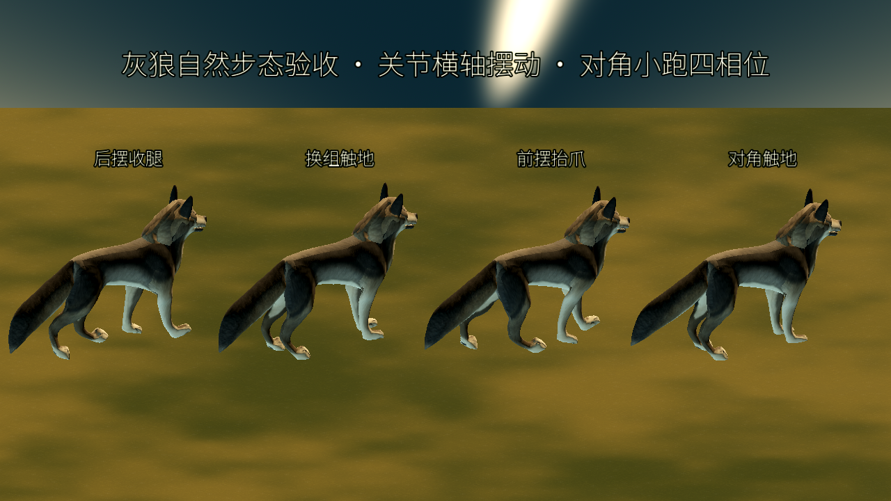

### V1.46：前腕与后膝可读性修正

V1.45 虽然已把腿部摆动轴修正到横向铰链，但 GLB 回读显示摆动峰值的前腿中段只弯曲约 8°，后腿中段约 9.6°。这在近景里有数值变化，但在游戏俯视镜头下几乎不可读。

V1.46 把上段前后摆、前腕屈曲、后膝/跎收腿和爪部补偿分成独立参数。慢跑 GLB 回读的峰值为前腕 27.5°、后膝 34.8°，冲刺幅度进一步提高；支撑腿保留小幅屈曲来表现落地缓冲。Godot 发布门禁同时比较前腕与后膝在小跑两个相位的 quaternion 角度，不再允许只有爪部轨迹而中段关节不动。

### V1.47：腿长比例与真实关节链修正

V1.46 只比较中段骨骼自身的 quaternion 变化，能证明骨骼在旋转，却不能证明上下腿真的折叠。回读三个关节原点后发现，旧旋转方向在摆动峰值抵消了休止姿态的自然折角：中段数值变化更大，真实腿链却变得更直，这就是画面仍像整条腿一起摆动的原因。

V1.47 反转前腕、后膝与爪部补偿方向，使摆动期形成真实收腿轮廓；发布门禁改为测量 `上腿起点 → 中段关节 → 爪部关节` 的空间夹角，并要求前腿摆动期比支撑期至少多折叠 0.28 弧度、后腿至少 0.35 弧度，同时抽样检查冲刺动作的最大折叠。四肢高度同时压缩 10%，蒙皮顶点和休止骨架严格使用同一世界空间分段变换，爪部保持地面高度，躯干、头颈和技能挂点同步下降，不改游戏碰撞与数值。

### V1.48：剩余 29 种 V4 骨链、翼骨与长体波动

V1.48 将灰狼之外的 58 份 Hero/Mobile GLB 统一重建为可验证的 V4 契约。雪兔与其余 24 种地面动物均使用 22 骨，每条四肢包含上段、中段和足部三个可独立动画的段落；肘、膝、跛和趾点依据猫犬、有蹄、重型、灵长和龟类解剖方向分别设计。下颌与尾端也从躯干中分离，使进食、攻击和平衡动作不再只摆整个头或整条尾。

飞行类升级为 14 骨的肩翼—次级翼—初级飞羽三段链，振翼改为绕局部横向轴上下运动，翼尖会产生真实行程。长体类增加 `Spine_Rear` 和 `Chest`，青环蛇为 10 骨八段体轴，沼泽鳄为 22 骨体轴加低伏三段四肢。旧动作绕骨长轴扭转的问题已修正为真实侧向波动。

发布门禁除骨数和动作名外，还会在 Godot 导入后对每种地面动物采样前腿/后腿夹角、足部位移与独立转角，对两种鸟采样翼尖行程与初级飞羽转角，对蛇/鳄采样胸段与尾尖波动。Mobile 用小型踝部关节球裁剪换取预算，保留完整骨链，30 种总顶点 134,753 / 140,000。

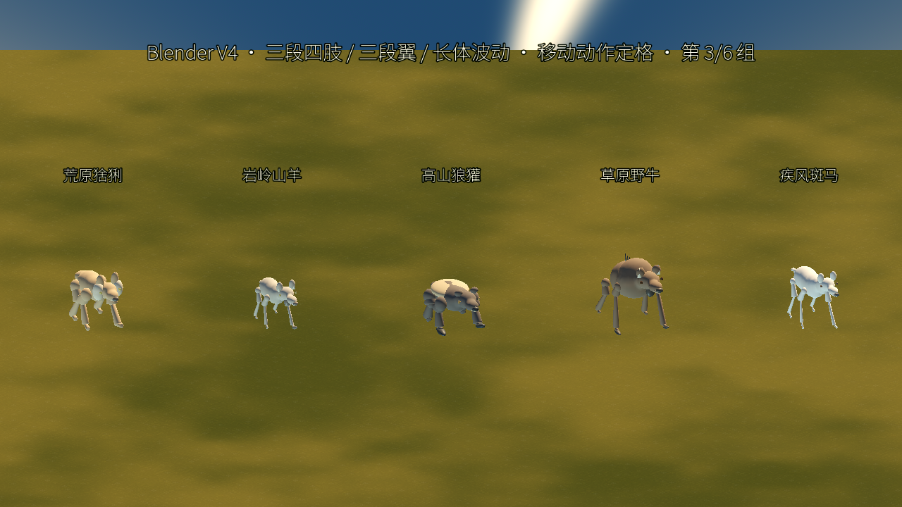

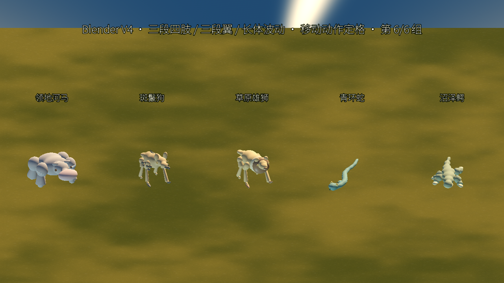

### V1.49：剩余 29 种 V5 实时近写实外观

V1.49 不修改灰狼样板，重新生成其余 29 种、共 58 份 Hero/Mobile GLB。地面动物不再只共享一套圆润躯体：每种分别定义躯干长宽、胸腹体量、颈长、头骨、吻长、耳形、肩胯和肢段粗细。厚球耳改为有正反面的薄片耳，眼、鼻、口与眉弓缩回更自然的比例；足端依据物种使用雪鞋掌、肉垫爪、分趾蹄、蹼足或低伏爬行足。

毛色、斑点、条纹、面盘、蛇环与鳄甲采用贴合主体表面的浅层结构，避免从躯干上悬浮成球。浣熊使用分段渐细环尾；鸟类增加主飞羽、渐细跗跖与趾爪；长体类保留连续体轴并强化鳞带与背甲轮廓。所有模型仍使用 V4 的骨数、插槽和八个烘焙动作，运行时无需改变 `EcoActor`、碰撞体或数值。

发布校验新增面部细节、薄片耳、物种足端与贴体花纹门禁，并继续采样三段腿链、翼尖和长体波动。骨骼动作改由既有距离 LOD 手动累计推进：近身仍逐帧，远处 AI 降频求值，移动、碰撞和决策仍保持物理帧更新。30 种 Mobile 模型实测总顶点为 125,344 / 140,000；第 10 关 100 个体基线为 59.8 FPS / 19.35 ms 物理平均。这里的“接近写实”指在 Web、Android、iOS 上实时运行的解剖与材质方向；离线影视高模仍需逐只雕刻、重拓扑、毛发系统、扫描级贴图和专用动画清理，不能用当前移动端 GLB 冒充。

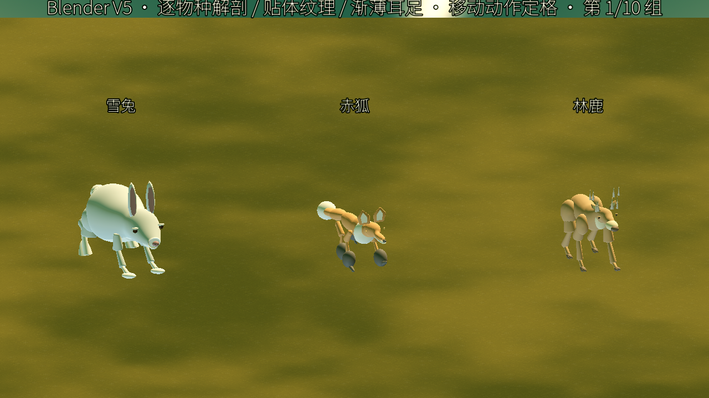

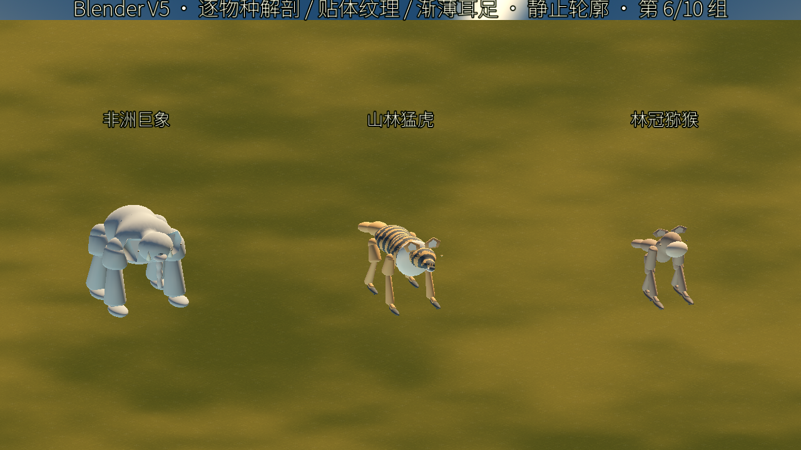

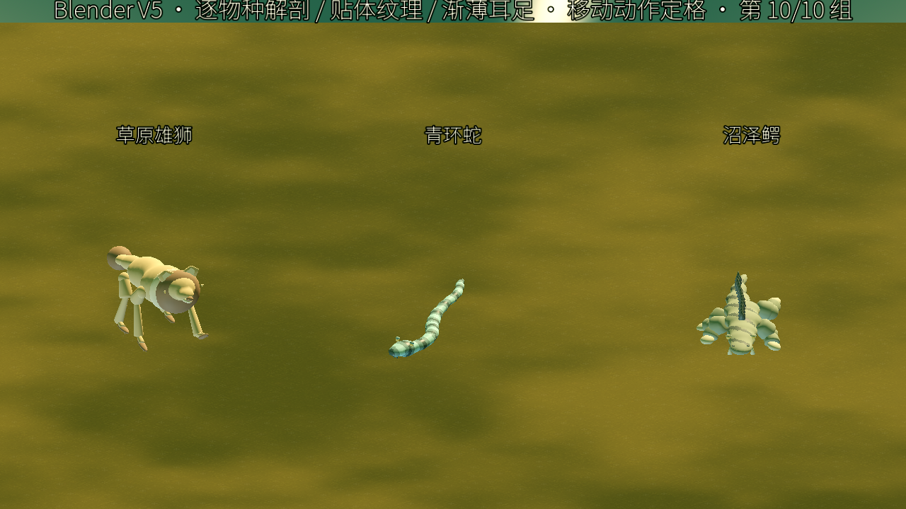

### V1.50：逐种外部写实替换 1/29

雪兔改用经授权审计的 CC0 带骨骼兔模型，不再由通用程序体块猜测头骨、耳、脚掌与毛色。生产器从原始 `.blend` 中读取两个连续权重网格、三张 1024×1024 内嵌贴图和 37 骨控制架，去除不必要 IK，转换为项目 22 骨、八态动作和两个技能挂点。

Hero 使用一级连续表面细分，Mobile 保留源拓扑；两者都使用相同的骨名、动作名、根比例和前向轴。雪兔 Mobile 为 2,300 顶点，替换后 30 种总计 124,602 / 140,000。每个后续物种必须同样提供可核对授权、原始源文件、Hero/Mobile、重绑骨架、八动作与三端门禁，不会把 V1.49 程序模型直接改名为“写实”。

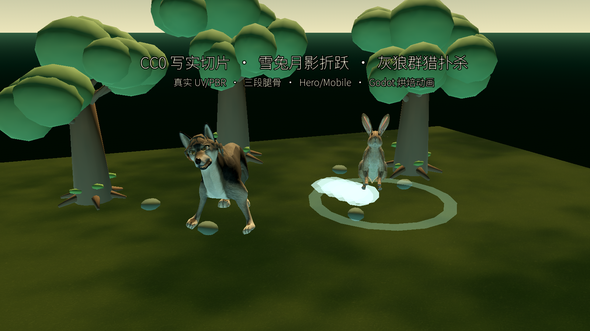

### 逐种外部写实替换 2/29：赤狐

赤狐使用 br-n518 的 CC0 模型作为 UV、体表和基础骨点来源。源文件只有 342 个渲染三角面，不能直接冒充写实成品；生产器会先应用镜像并修正头尾长度、胸腔、腰线、后躯和尾刷，再分别生成 Catmull-Clark Hero/Mobile 表面。

运行时不沿用 32 骨控制架，而是重建项目统一的 22 骨三段四肢，限制四骨权重并重新生成八态动作。Godot 实际 EcoActor 验收覆盖待机、移动、攻击、技能和四相行走，发布门禁同时检查连续躯干、动作、技能挂点、PBR 槽和移动端总预算。

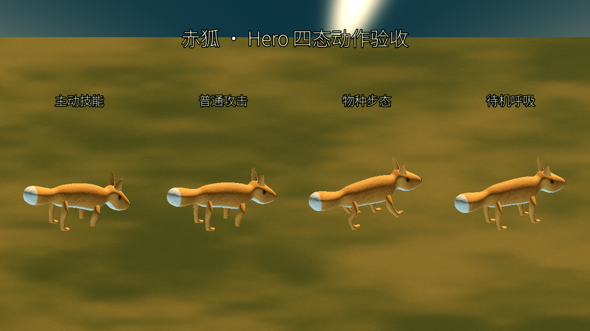

### 逐种外部写实替换 3/29：林鹿

林鹿使用 CDmir/TinyWorlds 的 CC0 母鹿作为连续身体、独立头部/眼部、鹿蹄、UV 和照片毛皮基础，并增加项目原创的移动端雄鹿角。源 31 骨中的 IK 和控制骨不进入运行时，额外肩椎权重合并到胸骨，最终保持 22 骨三段四肢契约。

Hero 对身体与头部做一级细分，并在最终拓扑上再次限制四骨权重；Mobile 保留 4,784 面源动物拓扑和精简鹿角。八态动作使用与源骨骼轴向无关的全局矢状面旋转，避免 Blender→glTF 后出现整腿绕错轴，行走采用四拍相位、冲刺采用收集奔驰相位。

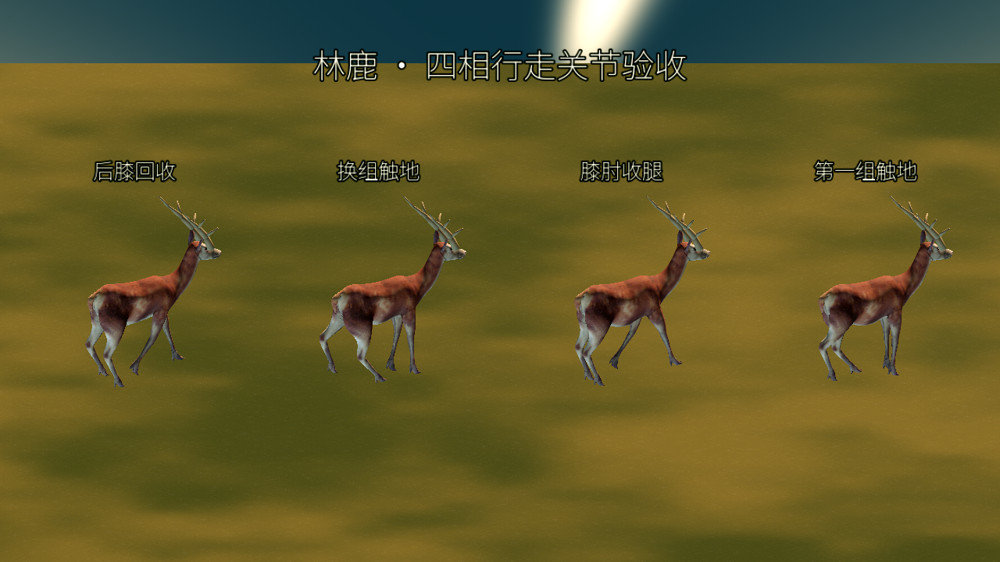

### 逐种外部写实替换 4/29：青环蛇

青环蛇使用 methodical pixel 的 CC0 带骨蛇作为连续躯干、UV 和体轴蒙皮基础。源只有 105 顶点 / 206 三角面，因此不直接作为成品：生产器保留连续拓扑与图集，用三/二级细分建立 Hero/Mobile，并用贴体腹鳞材质取代悬浮鳞带。

原有 18 骨精简为项目的 10 骨八段长体契约。`locomotion` 与 `sprint` 的每一段使用延迟相位，形成从头部向尾端传递的 S 形波；攻击另行驱动头颈弹出和下颌张开。Godot 验收会采样胸段和尾尖轨迹，不允许只左右旋转整个模型。

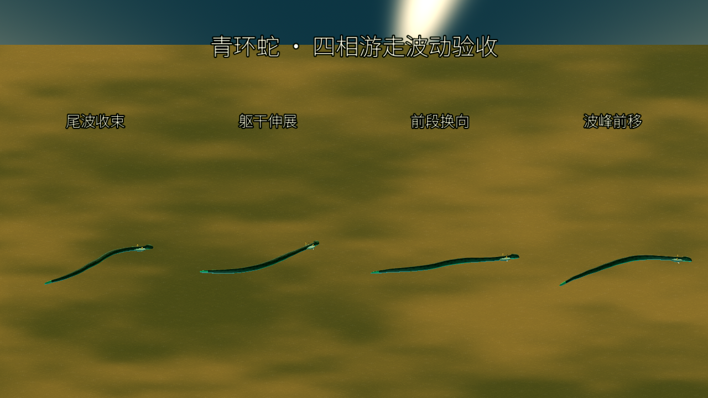

### 逐种外部写实替换 11/29：灵巧水獭

灵巧水獭使用 Poly by Google 的 CC-BY 3.0 `River otter` 作为成年河獭体态参考，许可证、署名、发布日期和引用链接独立归档。生产模型重建为项目原创的低矮流线连续体表，增加短须吻部、五趾蹼足、宽扁肌肉舵尾和防水深褐 PBR 毛皮。

Hero/Mobile 分别为 21,464 / 5,976 三角面，统一使用 22 骨与八态动作。陆地小跑保持三段腿折叠，浅水运动让胸腰和单张连续蒙皮尾部的两段尾骨产生相位波；“旋水突袭”同步收足、滚转躯干和扫尾，不再只是整只模型平移或单段尾尖摆动。

### 逐种外部写实替换 12/29：荒原猞猁

荒原猞猁使用 Poly by Google 的 CC-BY 3.0 `Bobcat` 作为成年体态参考，生产网格重建高臀紧凑猫科体轴、宽面短吻、分层颊毛、克制耳片与长耳簇、宽雪鞋掌和连续短黑尾。Hero/Mobile 分别为 17,970 / 5,828 三角面，使用 22 骨与八态动作；“无声飞扑”在技能动作中完成伏身、后膝折叠和四肢爆发伸展。

### 逐种外部写实替换 13/29：岩岭山羊

岩岭山羊使用 Poly by Google 的 CC-BY 3.0 `Goat` 作为成年体态参考，生产网格重建厚实紧凑躯干、短倾斜颈线、六段后掠弯角、渐细胡须、短窄下腿和分趾蹄。Hero/Mobile 分别为 17,998 / 5,376 三角面，使用 22 骨与八态动作；“崖跃角击”独立表现收腿起跳、后肢伸展和低头顶撞。

### 逐种外部写实替换 14/29：高山狼獾

高山狼獾使用 all of life 在 Sketchfab 发布的 CC-BY 4.0 `Wolverine` 作为成年体态参考。生产网格重建低伏厚实的鼬科体轴、宽头小圆耳、浅色肩带、宽大掘地掌、长爪和单体渐细粗尾；Hero/Mobile 分别为 19,064 / 4,860 三角面，Mobile 连续体表使用 0.56 轮廓保真减面，使用 22 骨与八态动作。“撕咬”技能增加后足支撑、躯干反向扭转、单掌钩击与张口深咬，不复用通用扑击。

### 逐种外部写实替换 15/29：草原野牛

草原野牛使用 Poly by Google 的 CC-BY 3.0 `Bison` 作为成年美洲野牛体态参考。生产网格重建前重后轻体轴、巨大肩峰、压低的宽额头位、短弯角、紧凑后躯、胸须和前肢毛缘；Hero/Mobile 分别为 29,542 / 7,118 三角面，使用 22 骨与八态动作。“冲撞”技能增加低头蓄力、前肢锁定、后腿蹬伸与抬角收势，不复用通用有蹄类角击。

### 逐种外部写实替换 16/29：疾风斑马

疾风斑马使用 Poly by Google 的 CC-BY 3.0 `Zebra` 作为成年草原斑马体态参考。生产网格重建马科胸腔、长颈长头、直立鬃、单蹄与黑色尾穗；条纹采用白底上的低覆盖率宽黑带，并延伸到可动腿段，避免密集材质面远看像外露肋骨。Hero/Mobile 分别为 19,474 / 4,604 三角面，使用 22 骨与八态动作；技能独立制作重心前移、后膝收集和双蹄同步后踢。

### 逐种外部写实替换 17/29：非洲巨象

非洲巨象使用 Poly by Google 的 CC-BY 3.0 `Elephant` 作为成年非洲象体态参考。生产网格重建高肩深桶躯干、展开扇耳、连续蒙皮渐细象鼻、连续上弯象牙、承重三段柱状腿、圆脚垫与尾穗；象皮使用无毛粗糙 PBR，避免错误沿用哺乳动物毛皮法线。Hero/Mobile 分别为 30,638 / 7,232 三角面，使用 22 骨与八态动作；技能独立制作后足承重、双前足抬起、胸肩下压践踏以及头颈象鼻回弹。

### 逐种外部写实替换 18/29：山林猛虎

山林猛虎使用 Poly by Google 的 CC-BY 3.0 `Tiger` 作为成年虎体态参考。生产网格重建低伏宽厚猫科体轴、大头短吻、圆黑耳、白色颊毛、宽圆猫掌、一体环纹尾以及贴体低覆盖率黑纹；条纹延伸到独立关节腿段但不使用悬浮装饰片。Hero/Mobile 分别为 24,688 / 5,718 三角面，使用 22 骨与八态动作；技能独立制作压低骨盆、后膝收集、后足爆发、双前掌前伸与张口扑杀。

### 逐种外部写实替换 19/29：林冠猕猴

林冠猕猴使用 Poly by Google 的 CC-BY 3.0 `monkey` 作为猕猴体态参考。生产网格重建短陡躯干、长前臂、弯曲后肢、紧凑裸面、圆耳、抓握手足和连续蒙皮弯曲平衡尾；Hero 实测 12,916 三角面，Mobile 为 3,514 三角面，使用 22 骨与八态动作；技能独立制作三足支撑、躯干反向扭转、右臂抬起与果实释放。

### 逐种外部写实替换 20/29：暗夜雕鸮

暗夜雕鸮使用 Poly by Google 的 CC-BY 3.0 `Owl` 作为猛禽轮廓参考。生产网格重建桶状羽体、紧凑颈部、宽圆面盘、短钩喙、羽足趾爪、扇尾和贴体白灰斑羽区；Hero/Mobile 为 12,724 / 3,630 三角面，使用 14 骨左右三段翼链、八态基础动作及滑翔、振翼、俯冲、落地动作。

### 逐种外部写实替换 21/29：巨角驼鹿

巨角驼鹿使用 Poly by Google 的 CC-BY 3.0 `Elk` 作为鹿科体态参考。生产网格重建高肩深胸、倾斜后躯、加粗三段式长腿、长垂鼻吻、喉垂、分蹄与宽掌状鹿角；Mobile 为 5,726 三角面，使用 22 骨与八态动作；巨角横扫独立制作低头、后足驱动与抬角收势。

### 逐种外部写实替换 29/29：最终阵容完成

岩甲陆龟、草原猎豹、披甲犀牛、银背猩猩、高原金雕、领地河马、斑鬣狗与草原雄狮已按各自科属完成 Hero/Mobile、PBR、连续蒙皮、骨架、动作与挂点。三种长尾猎食者使用单一连续尾网格，不再由刚性胶囊拼接；斑鬣狗背鬃改为贴体低鬃，雄狮改为颈圈、双颊和胸前分层鬃毛。飞禽保持 14 骨三段翼链，地面动物保持 22 骨三段肢链。V1.64 棕熊增厚后，30 种 Mobile 总顶点为 129,202 / 140,000。

最终移动端优化只作用于 AI：Mobile 保留物种颜色图和标量粗糙度，玩家 Hero 继续保留完整高分辨率 PBR 通道；远景骨骼显示更新移出固定物理步，并按 actor ID 错峰。移动、碰撞、AI 决策和技能判定仍在固定物理帧执行。最终完整 RC 第 10 关 100 个体为 59.9 FPS / 19.67 ms 物理平均 / 149.3 MiB，Web 与 iOS 无签名 arm64 构建通过。

### V1.64：棕熊厚重成年体态增强

V1.64 在 V1.63 的成年棕熊解剖基础上重新分配体量，而不是整体等比放大。胸腔、腹部和后躯横向加宽并向腹侧加深，腰腹下缘不再过早上收；肩颈连接、髋部、上臂和大腿同步增厚，形成适合成年棕熊的桶状躯干与承重前肢。头骨、短深吻、小圆耳、隐藏短尾和掌行足保持原尺度，避免出现充气感或脚掌失真。

Hero 为 21,116 三角面 / 10,586 顶点，Mobile 为 9,060 三角面 / 4,558 顶点。两档仍是精确 22 骨、四条 `Leg → Lower → Paw` 三段肢链、八态烘焙动作、连续毛皮主网格和吻部/胸部双技能挂点；四相预览确认增厚后膝肘继续独立屈伸，没有退化为整条腿摆动。Godot 导入后 30 种 Mobile 总顶点为 129,202 / 140,000，保留 10,798 顶点余量。V1.64 性能门禁为 L1 60.1 FPS / 6.53 ms / 100.1 MiB、L5 60.0 / 11.43 / 123.4、L10 59.9 / 18.25 / 149.2；Web 发布包与 iOS 1.64/build 760 无签名 arm64 构建均通过。碰撞、成长比例、生命、攻击、速度、技能数值和生态 AI 均未改变。

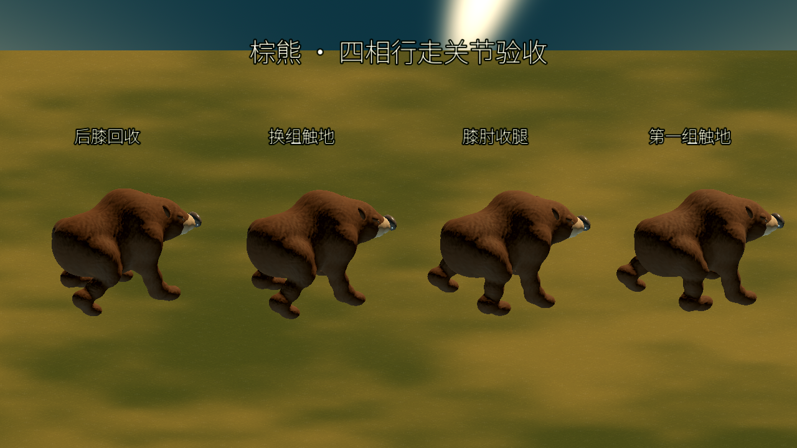

### V1.63：棕熊成年体态与专属掌行动作重制

V1.63 针对棕熊近景中暴露出的长头细颈、圆盘耳、扁平大脚、球形短尾和通用侧对步进行第二次解剖重制。生产网格缩短颈部与吻部，扩大头骨和胸颈连接，建立前高后低的肩峰、深桶胸腔和粗短承重四肢；耳廓缩为头顶小圆耳，尾骨仍保留在 22 骨契约中，但可见尾部收进臀部毛皮。足掌保留掌行接地面，去除在远景会合并成浅色圆弧的独立长爪。

Hero 为 20,100 三角面 / 10,078 顶点，Mobile 为 8,620 三角面 / 4,338 顶点。两档继续使用一张连续毛皮主网格、四骨权重限制、完整八态动作和吻部/胸部技能挂点。新 `locomotion` 使用交错四拍掌行，步行降低跨步幅度并保持足掌接地；`sprint` 使用紧凑滚动冲刺；普通攻击与技能分别为单掌挥击和双掌震地。战斗数值、碰撞、成长比例和生态 AI 均不随美术重制改变。

Godot 发布契约实测 30 种 Mobile 总顶点为 128,984 / 140,000。V1.63 性能门禁为 L1 60.1 FPS / 6.55 ms / 100.1 MiB、L5 60.0 / 13.09 / 123.4、L10 59.9 / 17.38 / 149.2；Web 发布包与 iOS 1.63/build 750 无签名 arm64 构建均通过，Android 仍因本机缺少 Platform 36、Build Tools 35.0.1 与 adb 标记为工具链阻塞。

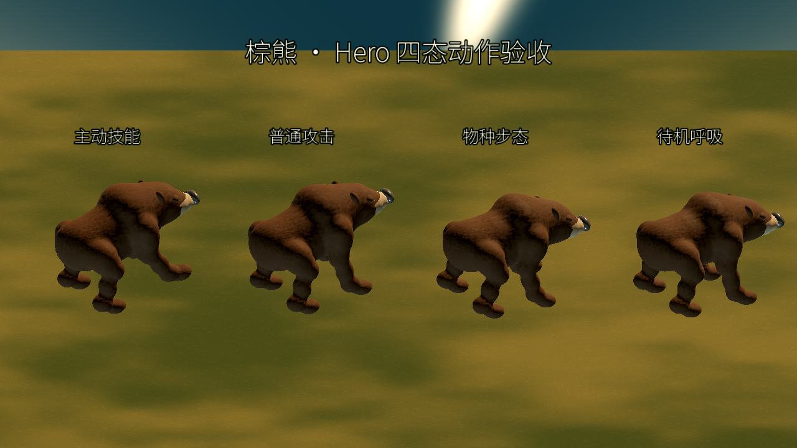

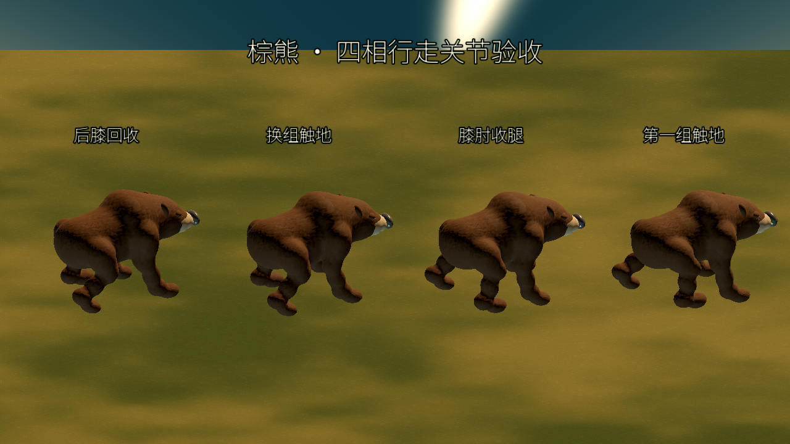

### 阶段 C：四生态区与十关地标

完成 4 组模块化地图资产，用 MultiMesh 替换重复小植被，为十关图腾制作统一造型系统，保持原有生态区逻辑与可达性。

### 阶段 D：全部技能特效

在 6 种基础特效家族上完成 30 个物种的独立组合，加入低/中/高画质数量档，进行 100 个体高强度混战压测。

### 阶段 E：发布验收

对 Web、Android 和 iOS 分别检查导入、显存、帧时间、稳定性、横屏双方向、热量与触控遮挡。自动构建通过不等于真机验收通过。

## 9. 验收原则

- 先和 V1.39 在相同镜头、光照和姿势下做前后对比，不用远景或过度景深掩盖模型问题；
- 每个动作检查足滑、穿插、关节折断、死亡姿势和技能命中对齐；
- 每个地图模块检查导航净空、视觉通路和实际通路是否一致；
- 每个技能在白天、黑夜、雨、雾与草丛背景上检查对比度；
- 新批次只在视觉、动画、性能和三端导出全部通过后才替换回退资产。
